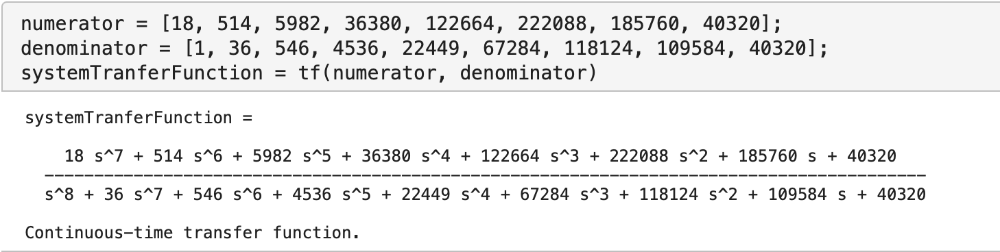
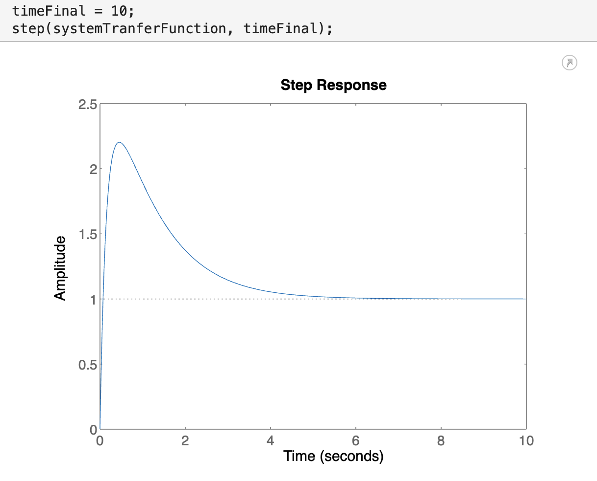
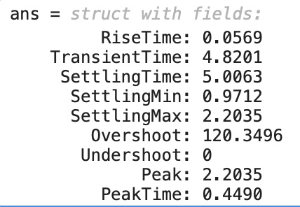
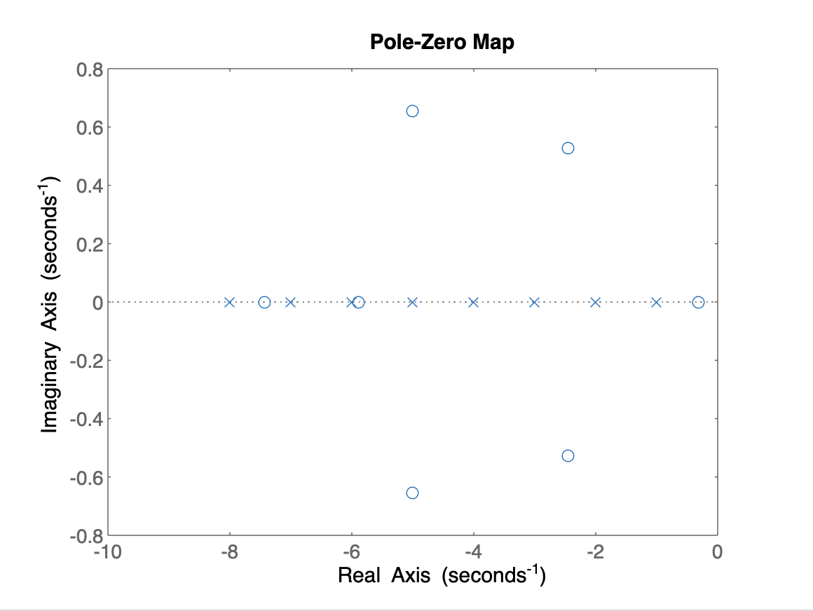
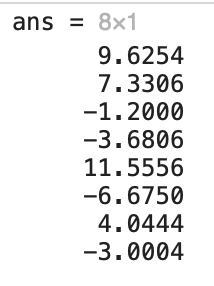
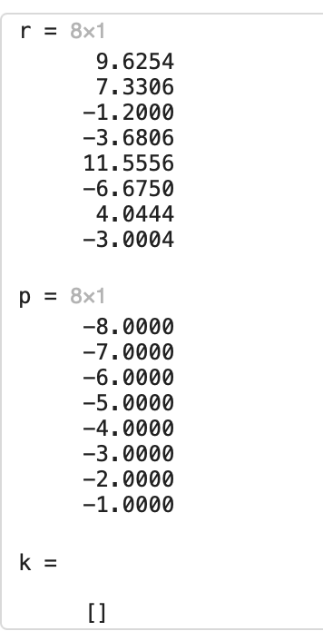
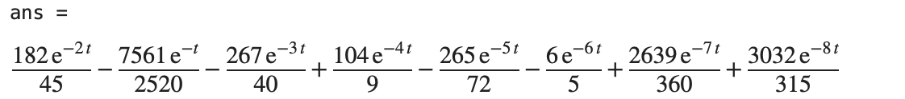
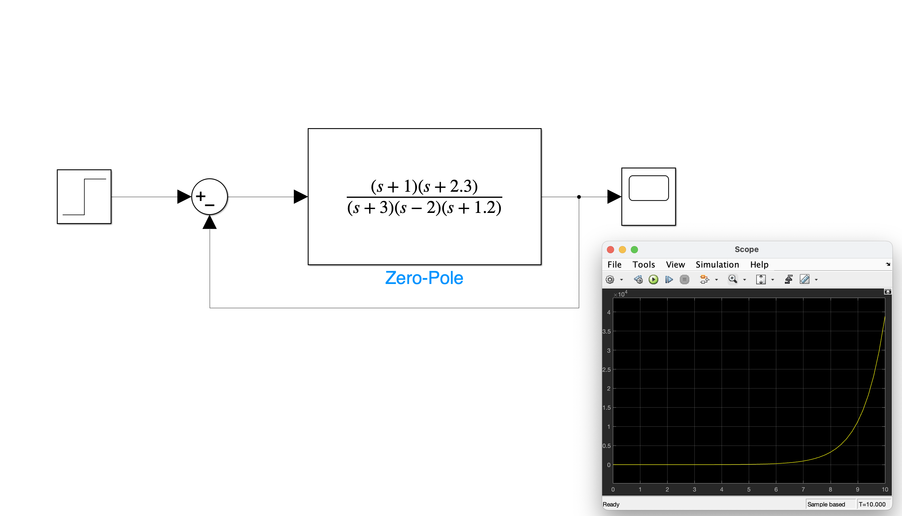
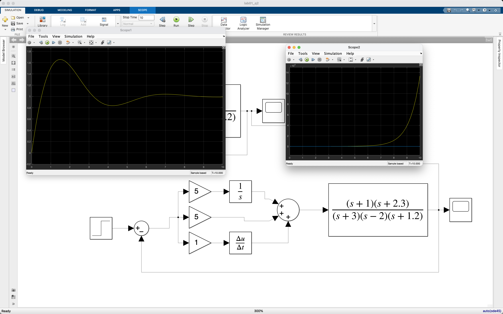

<!--
 * @Author: Frank Chu
 * @Date: 2022-11-12 10:43:31
 * @LastEditors: Frank Chu
 * @LastEditTime: 2022-11-12 20:11:09
 * @FilePath: /EE/Automatic-Control-Principles/lab01.md
 * @Description: 
 * 
 * Copyright (c) 2022 by Frank Chu, All Rights Reserved. 
-->
<!-- 
请按实验一要求完成实验一任务并提交实验报告。
1、实验报告以PDF附件形式递交；
2、在实验报告中必须先叙述实验内容，介绍相关理论知识，列出Matlab源程序，给出实验结果并进行必要的分析讨论。
3、实验报告首页应包括：
    1）实验题目
    2）姓名
    3）班级
    4）学号
    5）完成报告时间。 
-->

# 实验一 时域响应的计算机辅助分析法

褚勇

20电子信息工程（1）

2020331200003

2022/11/12

## 一、实验目的

1. 掌握在 Matlab 和 Simulink 中建立线性系统传递函数模型的方法；

2. 掌握使用 Matlab 求取线性系统时域响应的数值解的方法；

3. 掌握使用 Simulink 对线性系统进行仿真的方法；

4. 熟悉在 Matlab 下求取系统响应解析解的过程。

## 二、 相关知识点

### 1. Matlab 传递函数模型

设连续系统的传递函数为：

$$
G(s) = \frac{num(s)}{den(s)} = \frac{b_0s^m + b_1s^{m-1} + ... + b_{m-1}s + b_m}{a_0s^n + a_1s^{n-1} + ... + a_{n-1}s + a_n}
$$

则在 MATLAB 中，都可直接用分子/分母多项式系数构成的两个向量 num 与 den 构成的矢量组[num,den]表示系统，即

$$
num= [b_0, b_1 , ... , b_m  ] \\

den = [a_0, a_1 , ... , a_n]
$$

建立控制系统的传递函数模型（对象） 的函数为 [`tf()`](https://www.mathworks.com/help/control/ref/tf.html)，调用格式为：

```matlab
sys = tf(num,den)
% 返回的变量 sys 为连续系统的传递函数模型。 

sys=tf(othersys)
% 将任意的控制系统对象转换成传递函数模型。

% 例如：
s = tf('s'); g = 1 / (s^2 + 2 * s + 1); % 与如下命令完全等效
g = tf([1], [1 2 1]);
```

### 2. 零极点增益模型

设连续系统的零极点增益模型传递函数为：

$$
G(s) = k \frac{(s - z_1)(s - z_2)...(s - z_m)}{(s - p_1)(s - p_2) ... (s - p_n)}
$$

则在 MATLAB 中，可直接用向量 z, p, k 构成的矢量组 `[z,p,k]` 表示系统，即

$$
z= [z_0, z_1, ... , z_m] \\

p= [p_0, p_1, ... , p_n] \\

k= [k]; 根轨迹增益
$$

在 MATLAB 中，用函数 [`zpk()`](https://ww2.mathworks.cn/help/control/ref/zpk.html?requestedDomain=cn) 来建立控制系统的零极点增益模型，调用 格式为：

```matlab
sys=zpk(z,p,k) % 返回的变量 sys 为连续系统的零极点增益模型。 
sys=zpk(othersys) % 将任意的控制系统对象转换成零极点增益模型模型。
```

### 3. 环节方框图的化简

对于上图的两个环节串联，它们的传递函数为相乘

在 MATLAB 中，实现两个环节传递函数串联连接的运算为：

```matlab
sys1 = tf(num1,den1) 
sys2 = tf(num2,den2) 
sys = sys1 * sys2
```

实现两个环节传递函数并联连接的运算为：

```matlab
sys=sys1+sys2
```

实现反馈环节化简的运算为：

```matlab
sys=feedback(sys1,sys2,sign)
% 式中 sign 为反馈符号，‘+1’表示正反馈，‘-1’为负反馈。缺省为‘-’。 或者直接使用：
sys=feedback(sys1,sys2); % 默认为负反馈，如需正反馈，在 sys2 前 加-号
```

### 4. 用 SIMULINK 仿真工具建模

MATLAB 集成有 SIMULINK 工具箱，为用户提供了用方框图进行系统建

1. 建立新的结构图文件。在 matlab 环境下，点击 simulink 图标，或输入命令 simulink，启动 simulink 程序，出现 Simulink 模块库，如图 1 所示。模的图形窗口。
2. 点击或选择“File”菜单中的“New”选项下的子选项 “Model”，出现“untitled”空白文档。
3. 打开结构图模块组。在 Simulink Library Browser 中，点击 simulink 边上的“+”就有下列模块组： Sources（输入信号单元模块组） Sinks（数据输出单元模块组）Contionuous（线性单元模块组） Discrete （离散单元模块组）
4. 建立用户的仿真结构图。将所需的结构图模块用鼠标拖到新建立的结构图文件的空白处，依次完成仿真结构图。用鼠标 作结构图单元之间的连线，按结构图模块的信号连接关系，完 成仿真试验的结构图。
5. 连线方法：一般是选中一个输出口，按下鼠标左键拖动至 另一个模块的输入口，快捷的方法是先单击选中源模块，按下 Ctrl 键，再单击目标模块。画信号的分支线，用鼠标右键单击 信号线并拖动。
6. 模块的旋转和翻转：选中模块，右击鼠标，打开 Format 子菜单，选择 Flip Block、Rotate Block、Flip Name 等完成响应 的功能。
7. 结构图单元参数设置。用鼠标器双击任何一个结构图单元 即激活结构图单元的参数设置窗口。
8. 仿真参数设置。 选择“ simulink ”菜单项中的“ Simulink parameters”，即出现仿真参数设置子窗口，用于设置仿真参 数，例如，仿真起始时间，仿真终止时间，仿真布长，允许误 差，返回变量名称等。
9. 仿真操作。选中“simulink”中的“Start”启动系统的仿 真。在系统仿真中如显示器不能很好地展现波形，可以随时修 改显示器的定标，达到满意为止。

### 5. MATLAB 常用时域响应数值分析函数

（1） `step()`：求连续系统单位阶跃响应。调用格式为

```matlab
step(sys); % 绘制阶跃响应曲线； 
step(sys,Tfinal); % 绘制(0,Tfinal]区间内的阶跃响应曲线； 
[y,t]=step(sys); 
[y,t]=step(sys,TFinal); % 返回输出向量 y 和时间向量 t。
```

（2） impulse()：求连续系统单位脉冲响应。 调用格式如 step 函数。

（3）[`stepinfo()`](https://ww2.mathworks.cn/help/control/ref/lti.stepinfo.html)：求连续系统单位阶跃响应的各种参数。它返回一个包含各种时域响应指标参数的结构。


[`Overshoot`](https://ww2.mathworks.cn/help/control/ref/lti.stepinfo.html#mw_e60d4d41-8dff-4785-aa55-1c2423febe07) — Percentage overshoot (relative to yfinal)：超调量

SettlingTime — Settling time：调节时间；

RiseTime — Rise time：上升时间；

### 6. 使用 MATLAB 求取时域响应解析解

可以使用 [`residue()`](https://ww2.mathworks.cn/help/matlab/ref/residue.html)、`laplace()`、`ilaplace()`来求取系统时域响应的解 析解。

```matlab
[r,p,k] = residue(num,den); % 进行部分分式的分解。
```

## 三、实验内容

完成以下实验内容并提交实验报告。

### 1. 设系统的传递函数是：
$$
G(s) = \frac
{18s^7 + 514s^6 + 5982s^5 + 36380s^4 + 122664s^3 + 222088s^2 + 185760s + 40320}
{s^8 + 36s^7 + 546s^6 + 4536s^5+ 22449s^4 + 67284s^3 + 118124s^2 + 109584s + 40320}
$$

(1) 在 MATLAB 中建立其传递函数(tf)模型

```matlab
numerator = [18, 514, 5982, 36380, 122664, 222088, 185760, 40320];
denominator = [1, 36, 546, 4536, 22449, 67284, 118124, 109584, 40320];
systemTranferFunction = tf(numerator, denominator)
```



(2) 求取其 $(0,10]$ 秒内的阶跃响应的曲线

```matlab
timeFinal = 10;
step(systemTranferFunction, timeFinal);
```



(3) 求其超调量、调节时间、上升时间等指标参数

```matlab
stepinfo(systemTranferFunction)
```

[`Overshoot`](https://ww2.mathworks.cn/help/control/ref/lti.stepinfo.html#mw_e60d4d41-8dff-4785-aa55-1c2423febe07) — Percentage overshoot (relative to yfinal)：超调量

SettlingTime — Settling time：调节时间；

RiseTime — Rise time：上升时间；




（4） 求其零极点（zp）向量及分布图（使用 pzmap）函数；

```matlab
pzmap(systemTranferFunction);
```




From the figure above, an open-loop linear time-invariant system is stable if:

* In continuous-time, all the poles on the complex s-plane must be in the left-half plane (blue region) to ensure stability. The system is marginally stable if distinct poles lie on the imaginary axis, that is, the real parts of the poles are zero.
* In discrete-time, all the poles in the complex z-plane must lie inside the unit circle (blue region). The system is marginally stable if it has one or more poles lying on the unit circle.

（5） 将其分解为[部分分式](https://ww2.mathworks.cn/help/matlab/ref/residue.html)；

```matlab
residue(numerator, denominator)
[r, p, k] = residue(numerator, denominator)
% r — Residues of partial fraction expansion
% p — Poles of partial fraction expansion
% k — Direct term
```




（6） 写出其零初始条件下的单位脉冲响应的解析解。

```matlab
ilaplace(poly2sym(numerator) / poly2sym(denominator))
% https://www.mathworks.com/help/symbolic/sym.poly2sym.html
```



### 2. 设有单位负反馈系统的开环传递函数为

$$
G(s) = \frac{(s + 1)(s + 2.3)}{(s + 3)(s - 2)(s + 1.2)}
$$

（1）请在 Simulink 中建立如下（图 2）的仿真模型，并分析其输出响应（可以通过闭环系统的零极点分布加以分析）；



该系统不稳定，有极点在右侧

（2） 再建立如下（图 3）的仿真模型进行仿真，并和上面的模型进行比较分析（比较零极点发生的变化和输出响应的变化）。



极点均在 y 轴左侧，系统稳定。输出响应最终趋于平稳。

<!-- <script type="text/javascript" src="http://cdn.mathjax.org/mathjax/latest/MathJax.js?config=TeX-AMS-MML_HTMLorMML"></script>
<script type="text/x-mathjax-config">
    MathJax.Hub.Config({ tex2jax: {inlineMath: [['$', '$']]}, messageStyle: "none" });
</script> -->