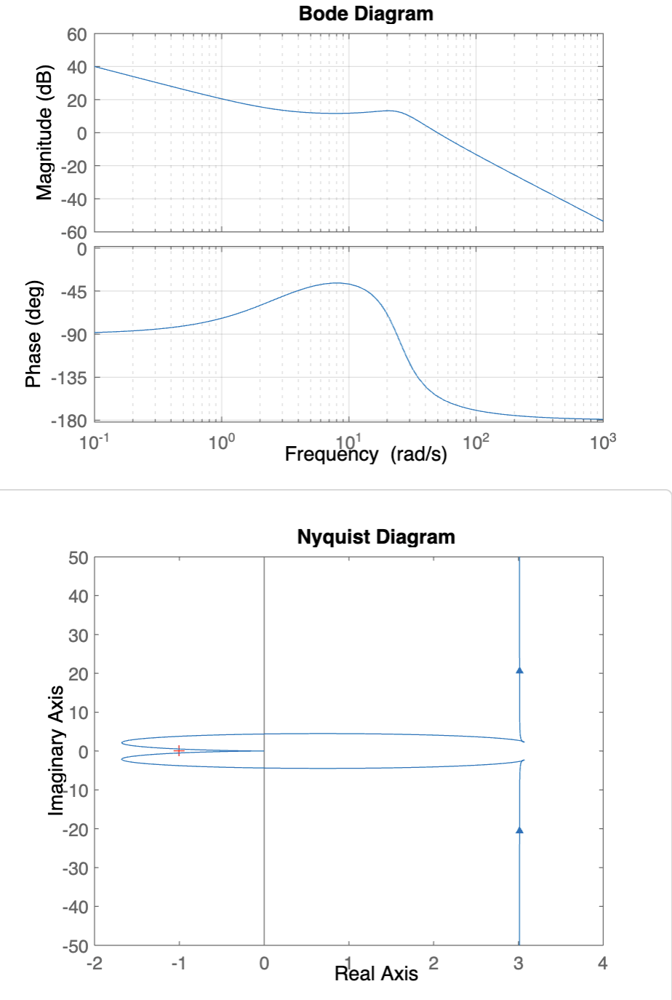
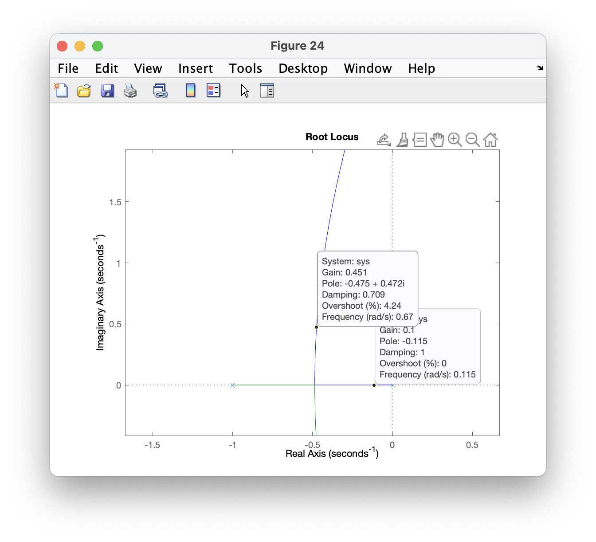
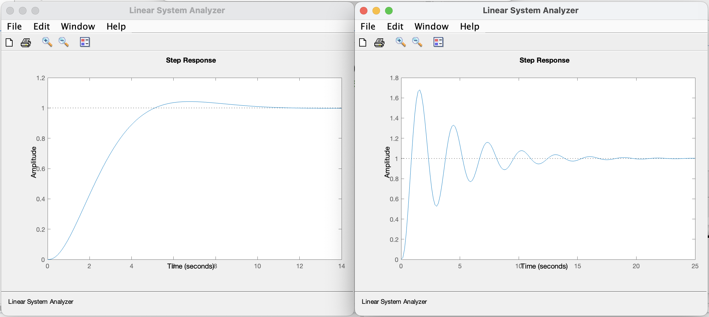
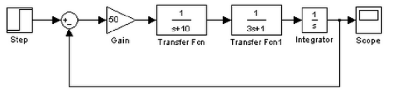
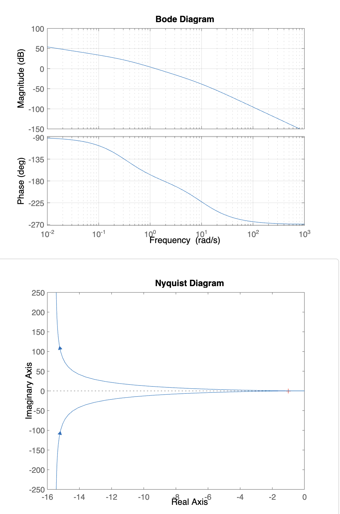
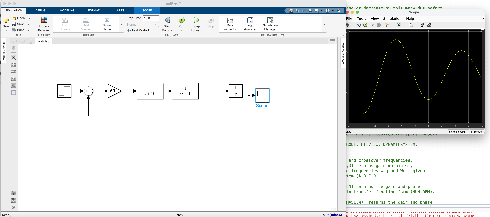

<!--
 * @Author: Frank Chu
 * @Date: 2022-12-13 18:45:36
 * @LastEditors: Frank Chu
 * @LastEditTime: 2022-12-13 21:23:48
 * @FilePath: /EE/Automatic-Control-Principles/lab02/lab02.md
 * @Description: 
 * 
 * Copyright (c) 2022 by Frank Chu, All Rights Reserved. 
-->
<!-- markdownlint-disable MD033 -->
# <center>实验二 控制系统根轨迹和频域响应的计算机辅助分析法</center>

<center>姓名：褚勇  学号：2020331200003 班级：20电信工程1班</center>

报告完成时间 Dec 13, 2022

## 一、实验目的

1. 掌握典型系统频率响应曲线 Bode 图的绘制方法；
2. 掌握典型系统频率响应曲线 Nyquist 图的绘制方法；
3. 熟悉在 Matlab 下稳定裕度的计算方法

## 二、相关知识点

### 1. 绘制根轨迹

```
rlocus(sys)
[k,p]=rlocfind(sys)
%在使用 rlocus 绘制出根轨迹后，运行本条命令，可以用十字光标点击根轨迹上的任意一点，自动计算出该点对应的增益和所有相应的闭环极点的坐标。
```

### 2. Bode 图命令格式

```m
bode(sys)
bode(sys1,…,sysN) 
bode(sys1,PlotStyle1,…,sysN,PlotStyleN) 
[mag,phase]=bode(sys,w) 
[mag,phase,wout]=bode(sys) 
[mag,phase,wout,sdmag,sdphase]=bode(sys)
```

### 3. Nyquist 图命令

```m
nyquist(sys) 
nyquist(sys,w) 
nyquist(sys1,…sysN) 
nyquist(sys1,…sysN,w) 
[re,im,w,sdre,sdim]=nyquist(sys) 
```

### 4. 稳定裕度求解命令

```m
margin(sys) %在 bode 图上直接标注出幅值裕量（Gm）、相位裕量（Pm）、 
剪切频率（Wcg），相位穿越频率（Wcp）。 
[Gm,Pm,Wcg,Wcp] = margin(sys) 
稳定裕量的定义： 
Wcg(Cut Gain Frequency)（幅值）剪切频率：
L(Wcg) = 20 lg|G(jWcg)| = 0； 
在 Bode 图上穿越 0dB 线，或在 Nyquist 图上穿越单位圆时的角频率。 
Pm(Phase Margin)相角裕量：当 Nyquist 图穿越单位圆或 Bode 图穿越 0dB线时，开环相角与-180o 的差，即：Pm=180+∠G(jWc)。这个角度越大， 
表明开环特性愈远离（-1,j0）点，相对愈稳定。Pm<0 是闭环不稳定的系 
统，Pm=0：临界自由振荡，Pm>0 稳定。 
Wcp(Cut Phase Frequency)相位穿越频率：∠G(jWcp) = −π。开环 Nyquist 
曲线穿越负实轴时的角频率。 
Gm(Gain Margin)幅值裕量：在 Nyquist 曲线穿越-180o 线时，幅值的倒数。 
以分贝值表示即为：Gm = 20(0 − lg|G(jWcp)|) = −20lg |G(jWcp)|。 
Gm>0 稳定，否则不稳定（包围-1+j0 点）。 
```

## 三、实验内容

### 1. 已知单位反馈系统的开环传递函数为，画 Bode 图，Nyquist 图，并判断系统的稳定性

$$
G = \frac{2083(s+3)}{s(s^2+ 20s +625)}
$$

```m
numerator = [2083 6249];
denominator = [1 20 625 0];
sys = tf(numerator, denominator);

% Bode Diagram
% 是一个内建函数，用于创建一个新的空白图形窗口
figure()
bode(sys);
% grid on 命令用于在当前图形中显示网格。
% 这可以帮助用户更好地理解图形的结构和数据之间的关系。
% 例如，在绘制数据点的图形时，网格可以帮助用户更容易地查看数据点之间的相对位置和分布情况。
grid on;

% Nyquist Diagram
figure()
nyquist(sys);
```

<p style="text-align:center">
    
</p>
通过bode图可以看出该系统的相角裕度和幅值裕度均大于0，所以该系统稳定。

通过 Nyquist 图可以看出其开环频率特性曲线并不包围 $(-1，j_0)$ 点，所以该系统稳定。

### 2. 给定单位反馈系统的开环传递函数为

$$
G = \frac{K}{s(s+1)(0.1s+1)}
$$

1. 绘制出系统的根轨迹；
2. 使用 `rlocfind` 计算使系统稳定的 K 值范围；
3. 如欲使闭环主导极点具有 0.707 的阻尼比，K=？
4. 使用 `stepinfo` 函数或 `ltiview` 工具计算和比较 K=5 与阻尼比为 0.707 时的闭环系统阶跃响应超调量、调节时间等各项参数。

```m
numerator = [1];  % numerator coefficients
denominator = conv([1, 0], conv([1, 1], [0.1, 1])); % denominator coefficients
sys = tf(numerator, denominator); % create transfer function model

figure();
% 该函数会绘制系统的基本极点图，并且可以通过改变系统的 K 值来查看稳定性如何变化。
rlocus(sys); % compute and plot the root locus
[K, poles] = rlocfind(sys); % find the gain values that make the system stable
```

<p style="text-align:center">
    
</p>

K 值范围约为 (0, 11)

如欲使闭环主导极点具有 0.707 的阻尼比，K = 0.451

使用 `stepinfo` 函数或 `ltiview` 工具计算和比较 K=5 与阻尼比为 0.707 时的闭环系统阶跃响应超调量、调节时间等各项参数。

```m
% stepinfo 是一个用于计算阶跃响应的参数的函数
% 它可以用来计算和比较一个闭环系统在不同参数下（如 K 和阻尼比）的阶跃响应。
K = 5;  % 系统的增益
sys_cl = feedback(K*sys,1);  % 闭环系统
stepinfo(sys_cl)  % 计算阶跃响应信息
ltiview(sys_cl)  % 使用 ltiview 工具计算阶跃响应信息

% 然后可以使用 step_info 中的属性（如 Overshoot，SettlingTime 等）来获取闭环系统的不同参数。
/**
ans = 
         RiseTime: 0.5320
    TransientTime: 14.9169
     SettlingTime: 14.9169
      SettlingMin: 0.5261
      SettlingMax: 1.6792
        Overshoot: 67.9244
       Undershoot: 0
             Peak: 1.6792
         PeakTime: 1.5837
*/

% 0.707 的阻尼比，K = 0.451

K = 0.451;  % 系统的增益
sys_cl = feedback(K * sys,1);  % 闭环系统 closed-loop system
stepinfo(sys_cl)  % 计算阶跃响应信息
ltiview(sys_cl)  % 使用 ltiview 工具计算阶跃响应信息

/**
ans = 
         RiseTime: 3.2253
    TransientTime: 8.9923
     SettlingTime: 8.9923
      SettlingMin: 0.9124
      SettlingMax: 1.0422
        Overshoot: 4.2247
       Undershoot: 0
             Peak: 1.0422
         PeakTime: 6.7836

*/
```



当 K 增大，系统阻尼比增大导致系统的超调量增大，同时调节时间增加，系统的峰值时间减小，峰值阻尼比的增大而增大。

### 3. 某控制系统结构图如图所示



<1>、利用 Matlab 建立上述控制系统的数学模型；

```m
numerator = [50];
denominator = conv(conv([1, 10], [3, 1]), [1, 0]);
sys = tf(numerator, denominator);

figure()
% returns the magnitude and phase of the response at each frequency in the vector wout
bode(sys);
grid on;

nyquist(sys);
```

<2>、绘制开环系统的 Bode 图和 Nyquist 曲线；

<p style="text-align:center">
    
</p>

<3>、判断系统的稳定性，如不稳定，绘制闭环系统的零极点图，给出极点位置；

* 通过bode图可以看出该系统的相角裕度和幅值裕度均大于0，所以该系统稳定
* 由nyquist可以看出可以看出其开环频率特性曲线并不包围 $(-1，j_0)$ 点，所以该系统稳定

<4>、计算系统的幅值裕度、相位裕度、相角穿越频率及幅值穿越频率；

```m
%   MARGIN(SYS) computes the gain margin Gm, the phase
%   margin Pm, and the associated frequencies Wcg and Wcp, for the SISO
%   open-loop model SYS (continuous or discrete). 
%   crossover frequenciescollapse

/**
http://bbs.eeworld.com.cn/thread-649003-1-1.html
转折频率，剪切频率，截止频率，极点，零点的概念总结 [复制链接]
Gm = 2.0674 幅值裕度 gain margin
Pm = 7.5689 相角裕度 phase margin
Wcg = 1.8257 相位穿越频率 Phase crossover frequency
Wcp = 1.2645 幅值穿越频率 Gain crossover frequency 剪切频率
*/
```

<5>、绘制系统的阶跃响应曲线；

<p style="text-align:center">
    
</p>