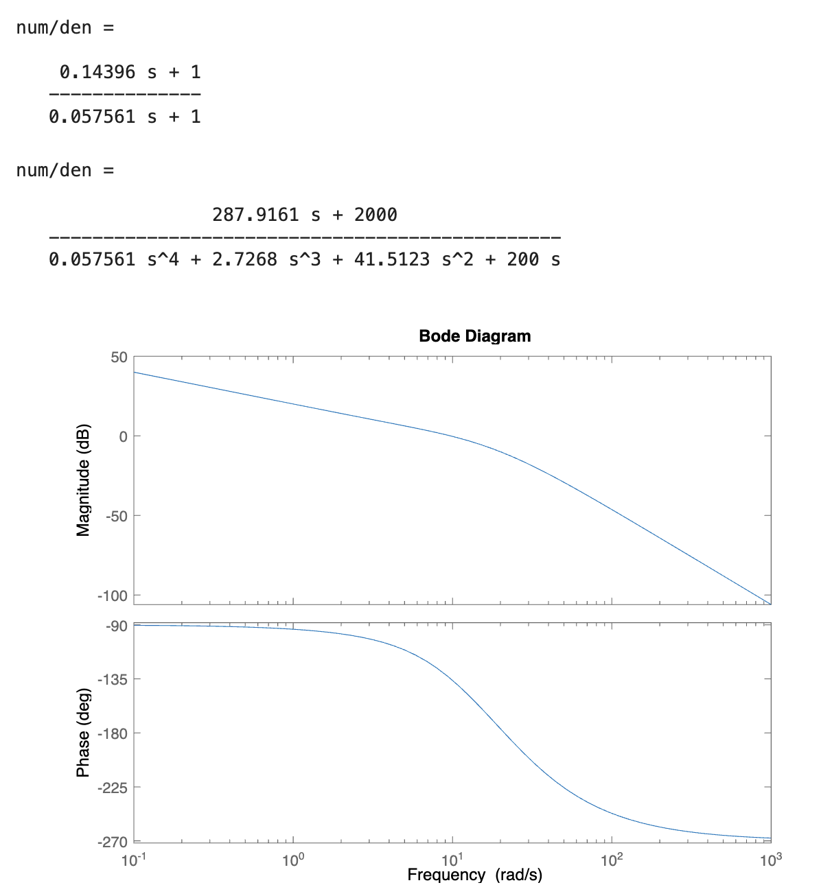
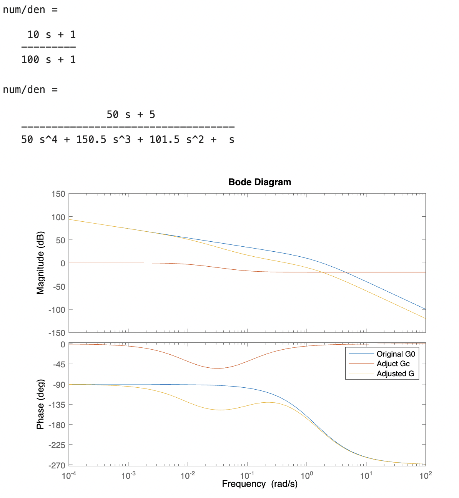

<!--
 * @Author: Frank Chu
 * @Date: 2022-12-20 19:44:38
 * @LastEditors: Frank Chu
 * @LastEditTime: 2023-01-03 19:42:14
 * @FilePath: /EE/Automatic-Control-Principles/lab03/readme.md
 * @Description: 
 * 
 * Copyright (c) 2022 by Frank Chu, All Rights Reserved. 
-->
<!--markdownlint-disable MD033-->
# <center>实验三 控制系统频率响应计算机辅助设计法</center>

<center>姓名：褚勇 学号：2020331200003 班级：20 电子信息工程（1）班</center>

## 一、实验目的

1. 掌握使用 Matlab 进行超前校正的辅助设计方法；
2. 掌握使用 Matlab 进行迟后校正的辅助设计方法；
3. 掌握使用 Matlab 进行迟后超前校正的辅助设计方法

## 二、相关知识点

### 1. 串联超前校正算法

### 2. 串联迟后校正算法

### 3. 串联迟后-超前校正算法

## 三、实验内容

### 1. 请详细阅读本例，将以下 m 文件输入 Matlab 并执行，观察结果

有单位反馈系统开环传递函数：$G_0(s)=\frac{400}{s(s^2+30s+200)}$

需要设计一个超前校正装置，满足以下指标：

1. 速度误差常数为 10；
2. 相角裕量为 45deg。

解：由于要求速度误差系数为 10 ， 所以开环放大倍数：Kc*400/200=10;Kc=5。

```m
% 算法 Matlab M 文件如下。

% 建立模型
num0=[2000];den0=[1,30,200,0];

%绘制原系统 bode 图。 
bode(num0,den0);

% 求取[幅值裕度，相位裕度，相位穿越频率，幅值穿越频率] 
[Gm1,Pm1,Wcg1,Wcp1]=margin(num0,den0); 

%期望相位裕度 
r=45; 

%现实相位裕度
r0=Pm1;

%产生 50 个 10^-1 到 10^3 之间的对数间隔角频率向量；
w=logspace(-1,3); 

%求取 G0 在 w 上各点的幅度和相位频率 响应值（是绝对幅值，不是对数幅值） 
[mag1,phase1]=bode(num0,den0,w);

for epsilon = 5 : 15
    % phim:由超前网络需要提供的校正相位φ m,epsilon 为补偿相角 
    phim = (r-r0+epsilon)*pi/180;
    
    %超前网络的系数α
    alpha=(1+sin(phim))/(1-sin(phim));
    
    %寻找新的截止频率点，在此点，|G0 *|Gc|=1,log|G0|+log|Gc|=0 
    [il,ii]=min(abs(mag1-1/sqrt(alpha)));
    
    %新截止频率点
    wc=w(ii);

    %超前校正的时间常数 Gc=（1+alpha*Ts)/(1+Ts)
    T=1/(wc*sqrt(alpha));

    numc=[alpha*T,1];denc=[T,1]; %构造校正环节的传递函数 
    
    [num,den]=series(num0,den0,numc,denc);%串联 Gc 与 G0 
    
    [Gm,Pm,Wcg,Wcp]=margin(num,den);%求取校正后的裕量 
    
    %如果相位裕量高于预期 r，结束循环
    if(Pm>=r);break;end
end 

printsys(numc,denc); 
printsys(num,den); 
bode(num,den);
```

<center>

</center>

### 2. 设计迟后校正装置

已知单位负反馈系统的开环传递函数 $G_0(s) = \frac{K}{s(s+1)(0.5s+1)}$

(1) 请利用 Matlab 设计一个迟后校正装置，使系统满足性能指标： 开环放大倍数 $K_v= 5$，相角裕量 $\gamma \geq 40 \degree$，幅值裕量 $h \geq 10dB$。

(2) 请利用 Matlab 设计一个迟后超前校正装置，使系统满足性能指标：开环放大倍数$K_v= 10$，相角裕量$\gamma \gt 50 \degree$，幅值裕量 $h \geq 10dB$。

(3) 求得以上两种校正下的系统的阶跃响应曲线和参数，进行比较分析。

（1）

迟后校正装置机器伯特图如下：

<center>

</center>

```m
numeratorOriginal = [5];

denumeratorOriginal = [0.5,1.5,1,0];

% bode Graph。
bode(numeratorOriginal,denumeratorOriginal);

% [Gain Margin, Phase Margin, Gain Cross-over Frequency, Phase Cross-over Frequency]
[Gm1, Pm1, Wcg1, Wcp1] = margin(numeratorOriginal,denumeratorOriginal);

% Expected Phase Margin
rExpectedPhaseMargin = 45;

% Actual Phase Margin
rActualPhaseMargin = Pm1;

% Expected Gain Margin
l = 10; 

% Actual Gain Margin
l0 = Gm1;

w = logspace(-1, 3);

[mag1, phase1] = bode(numeratorOriginal, denumeratorOriginal, w);

for epsilon=5:12 
    wc = 0; 

    % phim: adjust phase provided by the lead network
    phiM = (-180 + rExpectedPhaseMargin + epsilon) * pi / 180;
    
    atan(wc)+atan(0.5*wc)==-(pi / 2 + phiM);

    b=10^(-20/20);

    T = 1/(b*0.1);

    % construct the transfer function of the correction circuit
    numc = [b * T, 1];
    denc = [T, 1];
    
    [num, den] = series(numeratorOriginal, denumeratorOriginal, numc, denc);
    
    [Gm,Pm,Wcg,Wcp] = margin(num, den);

    if(Pm >= rExpectedPhaseMargin)
        break;
    end 
end 

Gmdb = 20 * log10(Gm), Pm

printsys(numc,denc); 
printsys(num,den); 

G0 = tf(numeratorOriginal, denumeratorOriginal); 
Gc = tf(numc,denc); 
G = tf(num,den); 
bode(G0, Gc, G); 
legend('Original G0','Adjuct Gc','Adjusted G')
```

(2)

迟后超前校正装置，伯特图如下：

<center>

</center>

```m
K = 10;

% Original System
s = tf('s'); 
G0 = K / (s * (s + 1) * (0.5 * s + 1)); 

% Expected Phase Margin
gamma = 50; 

% Expected Gain Margin
h = 10;

% Expected Cut-off Frequency
wc = 1.5; 

lb = 0.1;

ub = 1000;

gamma0_wc = 180 + angle(freqresp(G0, wc)) / (2 * pi) * 360; 

% Set the maximum phase of the correction circuit
phim = gamma - gamma0_wc + 6; 

% Solve for the parameter a
a = (1+sind(phim))/(1-sind(phim)); 

% Frequency of the second crossover point of the lead network
w4 = wc*sqrt(a); 

% Frequency of the first crossover point of the lead network
w3 = w4/a; 

% Adjust the phase provided by the lead network
Gclead = tf([1 / w3, 1], [1 / w4, 1]); 

% Adjusted System
Glead = Gclead * G0;

mag_wm = 20 * log10(abs(freqresp(Glead,wc)));

b = 10^(-mag_wm / 20); 

w2 = 0.1 * wc; 

w1 = b * w2;

% Transfer function of the lag network
Gclag = tf([1/w2,1],[1/w1,1]); 

% Transfer function of the correction circuit
Gc = Gclag * Gclead; 

% System after correction
G = Gc * G0; 

bode(G0, Gc, G, {lb,ub});
grid on
[Gm, Pm, Wcg, Wcp] = margin(G);

gamma
Pm
-20 * log10(1/Gm)
Wcp
step(G / (1 + G), 10);
```

(3)

阶跃响应曲线如下：

<center>

</center>

参数

```m
% 滞后校正
RiseTime: 2.3650
SettlingTime: 21.9948
SettlingMin: 0.9403
SettlingMax: 1.3477
Overshoot: 34.7696
Undershoot: 0
Peak: 1.3477
PeakTime: 6.1220

% 超前滞后校正
RiseTime: 0.8209
SettlingTime: 15.8013
SettlingMin: 0.9512
SettlingMax: 1.1716
Overshoot: 17.1646
Undershoot: 0
Peak: 1.1716
PeakTime: 1.8403
```

通过分析可知，超前滞后校正的系统的上升时间，调节时间比滞后校正的系统要短，且超调量也要小。可以看出，超前滞后校正的系统的性能要优于滞后校正的系统。
