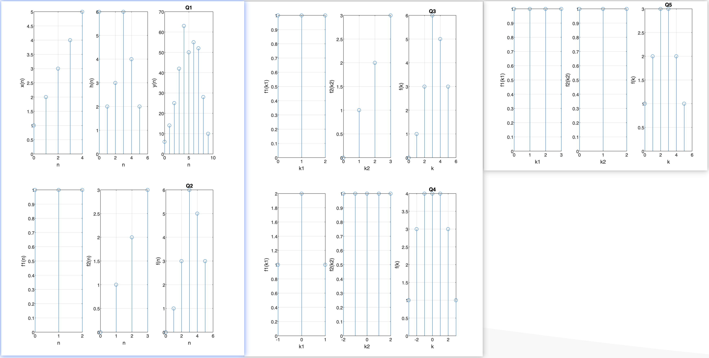

<!--
 * @Author: Frank Chu
 * @Date: 2022-10-13 08:28:50
 * @LastEditors: Frank Chu
 * @LastEditTime: 2022-10-13 13:37:28
 * @FilePath: /EE/DSP/lab01.md
 * @Description: 
 * 
 * Copyright (c) 2022 by Frank Chu, All Rights Reserved. 
-->

# 实验一：离散时间序列卷积和 MATLAB 实现

## 1. 根据实验原理，编写代码，得出实验结果，并画出波形图

## 2. 归纳、总结实验结果

### Question 1

令 $x(n) = \{1, 2, 3, 4, 5\}$，$h(n) = \{6, 2, 3, 6, 4, 2\}$，$y(n) = x(n) * h(n)$，求 $y(n)。$

```matlab
% Question 1
N = 5;
M = 6;
L = M + N - 1;

x = [1, 2, 3, 4, 5];
h = [6, 2, 3, 6, 4, 2];
y = conv(x, h);

nx = 0 : N - 1;
nh = 0 : M - 1;
ny = 0 : L - 1;

subplot(1, 3, 1);
stem(nx, x);
xlabel('n');
ylabel('x(n)');
grid on;

subplot(1, 3, 2);
stem(nh, h);
xlabel('n');
ylabel('h(n)');
grid on;

subplot(1, 3, 3);
stem(ny, y);
xlabel('n');
ylabel('y(n)');
grid on;
```

根据实验结果分析可知，实验所得与实际卷积结果相同。

### Question 2

已知序列

$
f_1(k) =
\left\{
    \begin{array}{ll}
    1 & 0 \leq k \leq 2 \\
    0 & others
    \end{array}
\right.
$
$
f_2(k) =
\left\{
    \begin{array}{ll}
        1 & k = 1 \\
        2 & k = 2 \\
        3 & k = 3 \\
        0 & others
    \end{array}
\right.
$

调用 `conv()` 函数求上述两序列的卷积和

```matlab
% Question 2
k1 = 3;
k2 = 3;
k = k1 + k2 - 1;

f1 = [1, 1, 1];
f2 = [0, 1, 2, 3];
f = conv(f1, f2);

nf1 = 0 : k1 - 1;
nf2 = 0 : k2;
nf = 0 : k;

subplot(1, 3, 1);
stem(nf1, f1);
xlabel('n');
ylabel('f1(n)');
grid on;

subplot(1, 3, 2);
stem(nf2, f2);
xlabel('n');
ylabel('f2(n)');
grid on;

subplot(1, 3, 3);
stem(nf, f);
xlabel('n');
ylabel('f(n)');
grid on;
```

根据实验结果分析可知，实验所得的数值跟 $f_1(n)$ 与 $f_2(n)$ 所卷积的结果相同。

### Question 3

编写计算两离散序列卷积和 $f(k) = f_1(k) * f_2(k)$ 的实用函数 `dconv()`。要求该程序再计算出卷积和 $f(k)$ 的同时，还绘出序列 $f_1(k)$，$f_2(k)$，和 $f(k)$ 的时域波形图，并返回 $f(k)$ 的非零样值点的对应向量。

```matlab
function[f, k] = dconv(f1, f2, k1, k2)
% f1(k), f2(k) 及 f(k) 的对应序号向量分别为 k1, k2 和 k。
```

```matlab
% Question 3
f1 = [1, 1, 1];
f2 = [0, 1, 2, 3];

nf1 = 0 : k1 - 1;
nf2 = 0 : k2;
nf = 0 : k;
[f, k] = dconv(f1, f2, nf1, nf2);
title('Q3');

% Function declaration
function[f, k] = dconv(f1, f2, k1, k2)
f=conv(f1, f2);

k(1) = k1(1) + k2(1);
k(length(f)) = k1(length(f1)) + k2(length(f2));
k = k(1) : k(length(f));

subplot(1, 3, 1);
stem(k1, f1);
xlabel('k1');
ylabel('f1(k1)');
grid on;

subplot(1, 3, 2);
stem(k2, f2);
xlabel('k2');
ylabel('f2(k2)');
grid on;

subplot(1, 3, 3);
stem(k, f);
xlabel('k');
ylabel('f(k)');
grid on;
end
```

该程序编写了一个可以在计算出卷的和 $f(k)$ 的同时，还绘出序列 $f_1(k)$，$f_2(k)$ 和 $f(k)$ 的时域波形图的函数。

### Question 4

试用 **MATLAB** 计算如下所示序列 $f_1(k)$ 与 $f_2(k)$ 的卷积和 $f(k)$，绘出它们的时域波形，并说明序列 $f_1(k)$ 与 $f_2(k)$ 的时域宽度与序列 $f(k)$ 的时域宽度的关系。

提示：可用上述 `dconv()` 的函数来解决。

$
f_1(k) =
\left\{
    \begin{array}{ll}
    1 & k = -1 \\
    2 & k = 0 \\
    1 & k = 1 \\
    0 & others \\
    \end{array}
\right.
$
$
f_2(k) =
\left
\{
\begin{array}{ll}
    1 & -2 \leq k \leq 2 \\
    0 & others
\end{array}
\right.
$

```matlab
% Question 4
f1 = [1, 2, 1];
f2 = [1, 1, 1, 1, 1];

k1Start = -1;
k1End = length(f1) + k1Start - 1;
k1 = k1Start: k1End;

k2Start = -2;
k2End = length(f2) + k2Start - 1;
k2 = k2Start: k2End;

dconv(f1, f2, k1, k2);
title('Q4');
```

根据实验结果分析可知，实验所得的数值跟 $f_1(n)$ 与 $f_2(n)$ 所卷积的结果相同。直接调用已经编好的函数，得到卷积结果及图形。

### Question 5

已知某 LTI 离散系统，其单位响应 $h(k) = e(k) - e(k - 4)$，求该系统在激励为 $f(k) = e(k) - e(k - 3)$ 时的零状态响应，并绘出其时域波形图。

提示：可用 `dconv()` 的函数来解决。

```matlab
% Question 5
f1 = [1, 1, 1, 1];
f2 = [1, 1, 1];

k1Start = 0;
k1End = length(f1) + k1Start - 1;
k1 = k1Start: k1End;

k2Start = 0;
k2End = length(f2) + k2Start - 1;
k2 = k2Start: k2End;

dconv(f1, f2, k1, k2);
title('Q5');
```

根据实验结果分析可知，实验所得的数值，跟 $f_1(n)$ 与 $f_2(n)$ 所卷积的结果相同。直接调用已经编好的函数，得到卷积结果及图形。系统的零状态响应，就是激励信号与该系统的单位响应的卷积。



## 3. 心得体会及其他

通过 **MATLAB** 的仿真，可以得到离散序列卷积的结果。利用其中的函数功能，能够更加方便的写出可以复用的功能。
