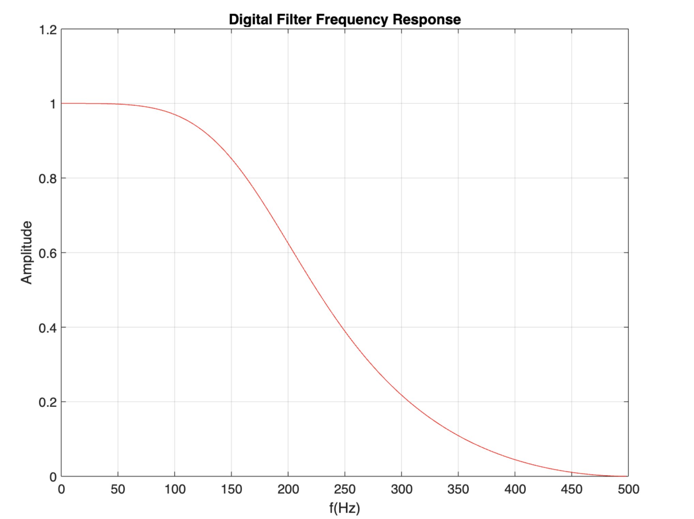

<!--
 * @Author: Frank Chu
 * @Date: 2022-11-24 10:16:05
 * @LastEditors: Frank Chu
 * @LastEditTime: 2022-11-24 23:07:36
 * @FilePath: /undefined/Users/yongfrank/Developer/EE/DSP/lab02_butterworth_filter.md
 * @Description: 
 * 
 * Copyright (c) 2022 by Frank Chu, All Rights Reserved. 
-->
# 实验二：数字滤波器的设计

## 1．根据实验原理，编写代码，得出实验结果，并画出波形图

## 2. 归纳、总结实验结果

试用双线性 Z 变换法设计: `低通数字滤波器`，给定技术指标:

$$
f_{passband} = 100 Hz \\
f_{stopband} = 300 Hz \\
\alpha_p = 3 dB \\
\alpha_s = 20 dB \\
F_{sampling} = 1000Hz
$$

用所设计的滤波器对实际心电图信号采样序列进行仿真滤波处理，并分别打印出滤波前后的心电图信号波形图，观察总结滤波作用与效果。

心电图信号采样序列 $x(n)$: 人体心电图信号在测量过程中往往受到工业高频干扰，所以必须经过低通滤波处理后，才能作为判断心脏功能的有用信息。下面给出一实际心电图信号采样序列样本 $x(n)$，其中存在高频干扰。在实验中，以 $x(n)$ 作为输入序列，滤出其中的干扰成分。

```matlab
x(n)={-4，  -2，   0，  -4，  -6，  -4， -2， -4， -6，  -6，
      -4，  -4，  -6，  -6，  -2，   6， 12，  8，  0， -16，
      -38，-60， -84， -90， -66， -32， -4， -2， -4，   8，
       12，  12，  10，   6，   6，   6，  4，  0，  0，   0，
       0，    0，  -2，  -4，   0，   0，  0， -2， -2，   0，
       0，   -2，  -2，  -2，  -2，   0}

```

### 双线性变换法

从 $s$ 域映射到正切 $tan$，再从 $tan$ 映射到 $z$ 域

$$
s = \frac{2}{T} \cdot \frac{1 - z^{-1}}{1 + z^{-1}} \\
j\Omega = \frac{2}{T} j\tan \frac{\omega}{2} (s=j\Omega) \\
z = \frac{1 + sT/2}{1-sT/2} \\
$$

数字滤波器原理

$$
x_0(t) \rightarrow H_1(s) \rightarrow x(t) \rightarrow 抽样/量化 \rightarrow \\
x(n) \rightarrow H(z) \rightarrow y(n) \rightarrow y_s(t) \rightarrow  \\
H_2(s) \rightarrow y(t)
$$

```matlab
x = [-4 -2 0 -4 -6 -4 -2 -4 -6 -6 -4 -4 -6 -6 -2 6 12 8 0 -16 -38 -60 -84 -90 -66 -32 -4 -2 -4 8 12 12 10 6 6 6 4 0 0 0 0 0 -2 4 0 0 0 -2 -2 0 0 -2 -2 -2 -2 0];
```



```matlab
ECG = [-4 -2 0 -4 -6 -4 -2 -4 -6 -6 -4 -4 -6 -6 -2 6 12 8 0 -16 -38 -60 -84 -90 -66 -32 -4 -2 -4 8 12 12 10 6 6 6 4 0 0 0 0 0 -2 4 0 0 0 -2 -2 0 0 -2 -2 -2 -2 0];
lengthOfECG = length(ECG); % lengthOfECG = 56
fourierFrequency = fft(ECG);
plot(0: lengthOfECG - 1, fourierFrequency);
title('Frequency Domain Signal');

% Digital Filter Specification
% 定义技术指标
fpassband=100;
fstopband=300;
FSampling = 1000;

% 求出 Digital 数字角频率
Wpassband = 2 * pi * fpassband / FSampling;
Wstopband = 2 * pi * fstopband / FSampling;

% Analog Domain
rpPassbandRipple = 3; % 3dB 通带波纹 %通带允许的最大衰减
rsStopbandAttenuation = 20; % 20dB 阻带衰减 %阻带允许的最小衰减

% 对角频率做预畸变
Fs = 1;
omegaP1PassbandCornerCutoffFrequency = 2 * Fs * tan(Wpassband/2);
omegaS1StopbandCornerFrequency = 2 * Fs * tan(Wstopband/2);

% Butterworth filter order and cutoff frequency
% 求出模拟低通滤波器的阶次，利用函数
[NorderOfButterworthFilter, WnCutoffFrequencies] = buttord(omegaP1PassbandCornerCutoffFrequency, omegaS1StopbandCornerFrequency, rpPassbandRipple, rsStopbandAttenuation, "s");
% N 代表滤波器阶数，Wn 代表滤波器的截止频率。
% 简单来说就是在 OmegaPassband 处，通带内波纹系数或者说是通带内达到最大衰减为Rp
% 如 (3db）,而在 OmegaStopband 处，阻带达到最小衰减为Rs（如 40db）
% 而我们默认求得的 Wn 是在(-3db)时的频率

% Butterworth filter prototype
% 设计模拟低通原型滤波器 G (p) ，其调用格式是
[Zeros, Poles, KGains] = buttap(NorderOfButterworthFilter);
% G(p) 的 Zeros 零点, Poles 极点, KGains 增益用于计算 N 阶归一化
% (3dB 截止频率 OmegaC=1）模拟低通原型滤波器系统函数
% 的零、极点和增益因子。

% Convert zero-pole-gain filter parameters to transfer function form
% 求模拟低通原型滤波器 G(p) 的分子分母系数
[bNumerator, aDenominator] = zp2tf(Zeros, Poles, KGains);
% G(p)的分子、分数系数从零、极点模型得到
% 系统函数的分子、分母多项式系数向量 ba、 aa

% Change cutoff frequency for lowpass analog filter
% 求出 G ( p ) 的分子、分数系数。
%   bt Transformed numerator and denominator coefficients, returned as row vectors.
%   at Transformed numerator and denominator coefficients, returned as row vectors.
[bt, at] = lp2lp(bNumerator, aDenominator, WnCutoffFrequencies);
% H(s)的分子、分数系数改变低通模拟滤波器的截止频率，
% 原滤波器是以多项式系数 Bap,Aap 给出的，改后的滤波器是带截止频率 Wn 的

% H(z)的分子、分数系数
[bzNumeratorcoefficients, azDenominatorcoefficients] = bilinear(bt, at, Fs);

% H 频率响应 rad / seconds
% Frequency response of digital filter
[HFrequencyResponse, WAngularFrequencies] = freqz(bzNumeratorcoefficients, azDenominatorcoefficients);

disp(bzNumeratorcoefficients);
disp(azDenominatorcoefficients);
% rad / s. omega = 2 * pi / T   
plot(WAngularFrequencies, abs(HFrequencyResponse));
grid on;
xlabel('t');
ylabel('Amplitude');
title('Digital Filter Frequency Response');
t = 1:56
x = [-4,-2,0,-4,-6,-4,-2,-4,-6,-6,-4,-4,-6,-6,-2,6,12,8,0,-16,-38,-60,-84,-90,-66,-32,-4,-2,-4,8,12,12,10,6,6,6,4,0,0,0,0,0,-2,-4,0,0,0,-2,-2,0,0,-2,-2,-2,-2,0];
plot(t, x);
title('滤波前的序列');

grid on;
y = filter( ,az,x);
figure(2);
plot(t,y);
grid on;
xlabel('t');ylabel('y');
title('滤波后的序列');
```


```matlab
%原心电信号
x1=[-4,-2,0,-4,-6,-4,-2,-4,-6,-6,-4,-4,-6,-6,-2,6,12,8,0,...
    -16,-38,-60,-84,-90,-66,-32,-4,-2,-4,8,12,12,10,6,6,6,4,0,0,...
    0,0,0,-2,-4,0,0,0,-2,-2,0,0,-2,-2,-2,-2,0];
m=size(x1,2);
nx1=0:m-1;

X1=fft(x1,1024);%计算xn的1024点fft
n=0:1023;
n1=2*n/1024;%计算1024点DFT对应的采样点频率
 
% 滤波后信号
y=filter(bz,az,x1);
% plot(nx1,y)
% title('滤波后')
%
%滤波后
X2=fft(y,1024);%计算xn的1024点fft
n=0:1023;
n2=2*n/1024;%计算1024点DFT对应的采样点频率

%%绘图
figure;
subplot(221),plot(nx1,x1);title('滤波前信号')
subplot(222),plot(nx1,y);title('滤波后信号')
subplot(223),plot(n1,abs(X1));xlabel('\pi'),title('滤波前幅频特性曲线');
subplot(224),plot(n2,abs(X2));xlabel('\pi'),title('滤波后幅频特性曲线');

Ts = 1;
figure;
subplot(211)
xx1=n1/Ts/2;
plot(xx1(1:end/2),abs(X1(1:end/2)));xlabel('Hz'),title('滤波前幅频特性曲线')
subplot(212)
xx2=n2/Ts/2;
plot(xx2(1:end/2),abs(X2(1:end/2)));xlabel('Hz'),title('滤波后幅频特性曲线')

% 
% n = 0:39;
% y = cos(2*pi*2*n/40);
% stem(n,y);
% stem(n, abs(fft(y)))

clear;
% 读取原始数据，这里是 n * 1 的数据
Signal = [-4 -2 0 -4 -6 -4 -2 -4 -6 -6 -4 -4 -6 -6 -2 6 12 8 0 -16 -38 -60 -84 -90 -66 -32 -4 -2 -4 8 12 12 10 6 6 6 4 0 0 0 0 0 -2 4 0 0 0 -2 -2 0 0 -2 -2 -2 -2 0];
%指标
wp = 2 * 100 / 1000 *pi;ws = 2* 300 / 1000 * pi;rp = 3;rs = 20;Fs = 1;
%计算
wp1=Fs*tan(wp/2);
ws1=Fs*tan(ws/2);
[N,Wn] = buttord(wp1,ws1,rp,rs,'s');
[Z,P,K] = buttap(N);
[Bap,Aap] = zp2tf(Z,P,K);
[b,a] = lp2lp(Bap,Aap,Wn);
[bz,az] = bilinear(b,a,Fs);
% 滤波
Signal_Filter = filter(bz, az, Signal); 
subplot(2, 1, 1);
plot(Signal);
title('原始图像');
subplot(2,1,2);
plot(Signal_Filter);
title('巴特沃斯低通滤波后图像');
```


## 3．心得体会及其他

## Reference

* 猿儿飘飘. 数字信号处理_巴特沃斯低通滤波器实验[EB/OL]. 2022[2022-04-16]. https://blog.csdn.net/weixin_48023487/article/details/124217932.
* Niel de Beaudrap. Writing multiplication dots[EB/OL]. 2013[2022-11-24]. https://tex.stackexchange.com/questions/113686/writing-multiplication-dots.
* 设计数字低通滤波器(用matlab实现).doc https://www.taodocs.com/p-249592419.html