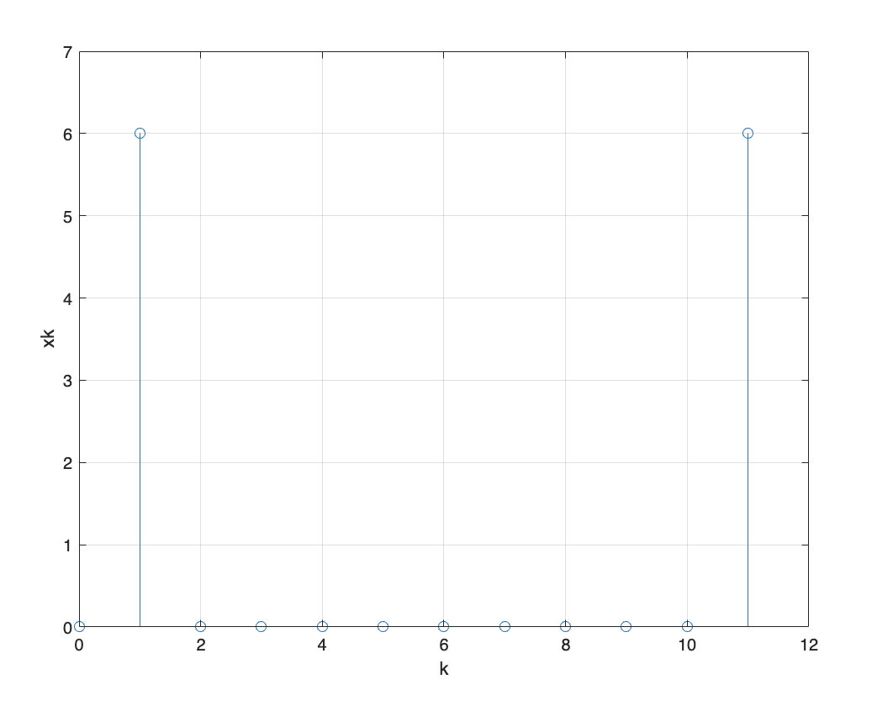

# 实验三：FFT 算法的 MATLAB 实现

## 1. 根据实验原理，编写代码，得出实验结果，并画出波形图

## 2. 归纳、总结实验结果

### Question 1

抱歉，我可能误解了你的问题。下面是脉冲响应不变法和双线性变换法的边界频率转换关系。

脉冲响应不变法中，边界频率 $f_{max}$ 和数字频率 $\omega_{max}$ 的转换关系为：
$$\omega_{max}=\tan\left(\frac{\pi f_{max}}{f_s}\right)$$

其中 $f_s$ 是采样频率。

参考链接：https://en.wikipedia.org/wiki/Impulse_invariant_transformation

双线性变换法中，边界频率 $f_c$ 和数字频率 $\omega_c$ 的转换关系为：
$$\omega_c=\frac{2}{T}\tan\left(\frac{2\pi f_cT}{2}\right)$$

其中 $T$ 是采样间隔。

参考链接：https://en.wikipedia.org/wiki/Bilinear_transform

脉冲响应不变法的边界频率转换关系是在模拟滤波器的截止频率为$f_c$时，数字滤波器的截止频率为$f_d=\frac{f_c}{1-f_cT}$，其中$T$为采样周期。

双线性变换法的边界频率转换关系为在模拟滤波器的截止频率为$f_c$时，数字滤波器的截止频率为$f_d=\frac{2}{T}\tan\left(\frac{\pi f_c}{f_s}\right)$，其中$T$为采样周期，$f_s$为采样率。

若 $x(n)=cos(n*pi/6)$是一个 $N=12$ 的有限序列，利用 MATLAB 计算它的 DFT 并画出图形。

$$
X_k = \sum_{n=0}^{N-1} x(n) \cdot e^{-\frac{j2\pi}{N}kn}
$$

```matlab
N = 12;
n = 0 : N - 1;
k = 0 : N - 1;
kn = n' * k;

xn = cos(n * pi / 6);

% Calculate the exponential of 1, which is Euler's number, e.
WN = exp(-1i * 2 * pi / N);

% https://www.mathworks.com/help/matlab/ref/power.html
xk = xn * (WN .^ kn);

stem(n, abs(xk));
xlabel('k');
ylabel('xk');
grid on;
```



用 DFT 和用 FFT 对序列进行运算，最后得到的结果相同。但用快速傅立叶变换的运算速度可以快很多。

### Question 2

一被噪声污染的信号，很难看出它所包含的频率分量，如一个由 50Hz 和 120Hz 正弦信号构成的信号，受均值随机噪声的干扰，数据采样率为 1000Hz，通过 FFT 来分析其信号频率成分，用 MATLAB 实现。

```matlab
fs = 1000;
N = 512; % N = 1024
n = 0 : N - 1;
t = 1 / fs * n; % sample time point
% T = N * 1 / fs

% 如一个由 50Hz 和 120Hz 正弦信号构成的信号
original_x = sin(2 * pi * 50 * t) + sin(2 * pi * 120 * t);
% original_x = sin(2 * pi * 10 * t);
rand_sig = rand(1, N)
x = original_x + rand_sig; % 1 row, N column, 受均值随机噪声的干扰
plot(t, original_x);
xlabel('t'); ylabel('Magnitude'); title('original');
plot(t, x);
xlabel('t'); ylabel('Magnitude'); title('noise');

y = fft(x, N); % 通过 FFT 来分析其信号频率成分

original_mag = abs(fft(original_x, N))
mag = abs(y);
f = n / N * fs; % 频率归一化

plot(f, original_mag);
xlabel('Frequency / Hz'); ylabel('Amplitude'); title('original signal, N = 1024');

plot(f, mag);
xlabel('Frequency / Hz'); ylabel('Magnitude'); title('N = 1024');

plot(f(1 : N / 2), mag(1 : N / 2));
xlabel('Frequency / Hz'); ylabel('Magnitude'); title('N = 1024');
```


用 FFT 运算，将序列转变到频域上，虽然信号受到均值随机噪声的干扰，但分析频谱可清楚看到原信号的频率，50Hz 120Hz。

### Question 3

题三：调用原始语音信号 mtlb，对其进行 FFT 变换后去掉幅值小于 1 的 FFT 变换值，最后重构语音信号。

要求有四幅语音信号的频谱图在同一图形窗口以便比较：分别是

1. 原始语音信号
2. FFT 变换；
3. 去掉幅值小于 1 的 FFT 变换值
4. 重构语音信号

```matlab
load mtlb
N = 2048;

% T -> N = 4096point -> fs(1000Hz) = N / T -> t = 1 / fs * (1: N), f = n / N * fs
t_amp = mtlb(1 : N);
f_amp = fft(t_amp);

plot(t_amp);
ylabel('amplitude'); xlabel('n'); title('original voice signal');

plot(abs(f_amp));
title('原频谱特性');

f_amp(abs(f_amp) < 1) = 0;
plot(abs(f_amp));
ylabel('amplitude'); xlabel('frequency'); title('reconstructed voice signal');

recon_amp = ifft(f_amp);
plot(recon_amp);
ylabel('amplitude'); xlabel('n'); title('reconstructed voice signal');

sound(mtlb);
```


## 3．心得体会及其他

本次实验主要温习了 DFT 以及 FFT 算法，及其实现，加深了对其物理意义的理解。

### Reference

1. fft算法的matlab实现过程详解 https://www.elecfans.com/lab/matlab/20171109576946.html