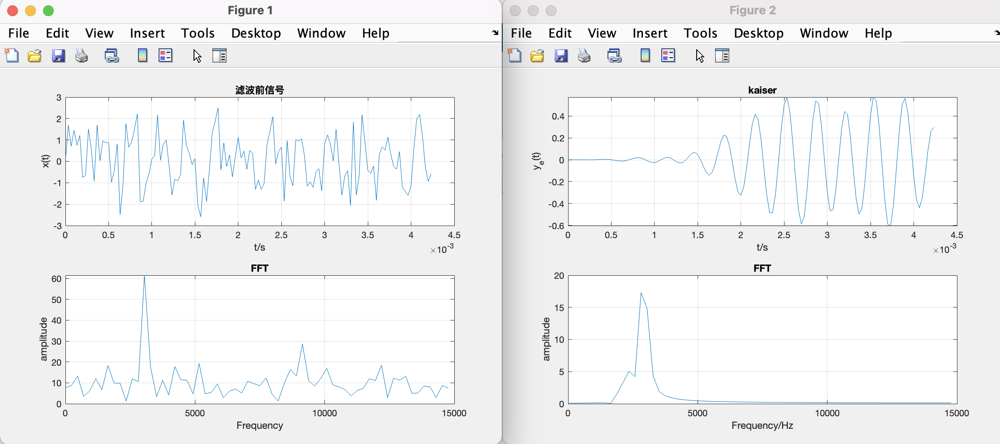

<!--
 * @Author: Frank Chu
 * @Date: 2022-12-31 00:05:18
 * @LastEditors: Frank Chu
 * @LastEditTime: 2022-12-31 01:38:23
 * @FilePath: /EE/DSP/project.md
 * @Description: 
 * 
 * Copyright (c) 2022 by Frank Chu, All Rights Reserved. 
-->

<!-- markdownlint-disable MD033 -->

# <center>FIR数字滤波器设计与仿真</center>

<center>班级：20 电子信息（1）班 姓名：褚勇 学号：2020331200003 </center>

## 简介

FIR（Finite Impulse Response）数字滤波器是一种线性时不变的数字滤波器，它的输出只与当前和过去的输入有关，而与未来的输入无关。FIR数字滤波器可以用来进行信号的频率特征提取、降噪、提高信噪比等操作。

## 1. 题目

设计一个数字滤波器对含有随机噪声的如下信号进行滤波

$$ y = sin(2\pi f_0 t) + rand(t) $$

1. $f_0$ 为 **学号** 后两位 $*1000Hz$；
2. 信号的采样率 $f_s$ 和长度 N 根据 $f_0$ 和频谱的频率分辨率 △f 自定义；(提示： fs需满足奈奎斯特采样定理， △f使找到 $f_0$ 的误差较小，N可取2的整数次幂，如1024等。)
3. 数字滤波器的类型为FIR滤波器，截止频率根据 $f_0$ 自定义；
4. 画出滤波前后的信号和频谱图共 4 幅图(如图)。
5. 报告字数不少于 2000字。

## 2. 原理

FIR数字滤波器的优点在于其实现简单，时延小，并且可以实现高通、低通、带通和带阻滤波器。缺点在于需要更多的系数来实现同等的滤波效果，并且对于较低的抽样频率，需要更多的系数才能实现同样的滤波效果。

FIR数字滤波器的结构基于卷积运算，其输出可以表示为输入信号与一个系数序列的卷积。 FIR数字滤波器的系数是固定的，并且通常通过数学优化方法来计算。

FIR（Finite Impulse Response）数字滤波器是一种线性时不变的数字滤波器，它的输出只与当前和过去的输入有关，而与未来的输入无关。FIR数字滤波器的输出可以表示为输入信号与一个系数序列的卷积。

其中x[n]表示输入信号的第n个采样点，h[n]表示滤波器的系数，y[n]表示输出信号的第n个采样点。

FIR 数字滤波器是由若干个单位延迟器和乘法器构成的。输入信号经过单位延迟器之后与滤波器系数进行乘法运算，然后将所有乘法器的输出累加起来得到输出信号。

根据卷积运算的定义，FIR数字滤波器的输出可以表示为：

y[n] = ∑h[k]*x[n-k] (k=0,1,...,M-1)

其中M为滤波器的阶数，h[k]为滤波器的第k个系数，x[n-k]表示输入信号在第n-k个采样点的值。

从上式中可以看出，FIR数字滤波器的输出仅与当前和过去的输入有关，与未来的输入无关。

### 窗函数设计法

窗函数是一种常用的信号处理方法，用于对信号进行滤波、平滑或者改变其频谱特性。窗函数通常用于信号分析和调制解调中，其主要作用是对信号进行加权平滑，从而抑制信号的边缘处的高频成分。

窗函数的设计法可以分为以下几类：

1. 直接设计法：根据所需的频谱特性直接设计窗函数的形式。常用的直接设计法有希尔伯特窗、高斯窗和汉宁窗等。
2. 无目标设计法：根据信号的时域特性来设计窗函数，不考虑频谱特性。常用的无目标设计法有矩形窗、三角窗和汉宁窗等。
3. 适应性设计法：根据信号的时域和频谱特性自适应地设计窗函数。常用的适应性设计法有调和窗、Bartlett-Hann窗和Flattop窗等。

通常情况下直接设计法和无目标设计法的窗函数设计效果较好，而适应性设计法的窗函数设计效果较差。

### 奈奎斯特采样定理

$$
f_s \geq 2f_n
$$

奈奎斯特采样定理是信号处理和通信系统中的一个基本原理，它指出，要准确地捕捉和重建信号，采样率（即每秒采样的数量）必须至少是被采样信号的最高频率的两倍。这意味着，如果要准确地捕捉和重建包含最大频率的信号，则必须以至少为该频率的两倍的速率对信号进行采样。

例如，如果要准确地捕捉和重建包含 20 kHz（人类听觉范围的上限）频率的音频信号，则必须以至少 40 kHz 的速率对信号进行采样。这是因为信号中的最高频率（20 kHz）必须至少被采样两次才能准确地捕捉和重建。

奈奎斯特采样定理很重要，因为它告诉我们，我们必须谨慎选择合适的采样率，否则可能会得到原始信号的不准确或失真的表示。这在音频和视频录制等应用中尤为重要，因为在这些应用中，原始信号的高质量再现非常重要。

### 几种常见的窗函数

1. 矩形窗（Rectangle Window）boxcar(n)，根据长度 n 产生一个矩形窗w。
2. 三角窗（Triangular Window）triang(n) ，根据长度 n 产生一个三角窗w。
3. 汉宁窗（Hanning Window）hanning(n) ，根据长度 n 产生一个汉宁窗w。
4. 海明窗（Hamming Window）hamming(n) ，根据长度 n 产生一个海明窗w。
5. 布拉克曼窗（Blackman Window）blackman(n) ，根据长度 n 产生一个布拉克曼窗w。
6. 恺撒窗（Kaiser Window）kaiser(n,beta) ，根据长度 n 和影响窗函数旁瓣β参数产生一个恺撒窗

## 3. 实现

学号后两位为 03，故信号频率用 3000Hz。根据奈奎斯特定理，采样频率大于两倍的原始信号频率，所以本次设计将采样频率定位十倍的原始信号频率。




```m
clc;
% 计算采样率 fs 和信号长度

% 原始信号频率 3 * 1000
fOriginal = 3000;

% 频谱的频率分辨率
delta_f = 10;

% 根据奈奎斯特采样定理得采样频率
fs = 10 * fOriginal + delta_f; 

% 信号长度，可以取2得整数次幂
N = 128;

% 生成随机噪声信号
n =0 : N - 1;
t = n / fs;
f = n * fs / N;

% 滤波前信号
% %RANDN Normally distributed pseudorandom numbers.
xt = sin(2 * pi * fOriginal * t) + randn(1,N);

% 画图
subplot(2,1,1);
plot(t,xt); 
grid; 
xlabel('t/s');
ylabel('x(t)');
title('滤波前信号');
grid on;

% 频谱图
h1 = fft(xt, N);
mag1 = abs(h1);
subplot(2,1,2);
plot(f(1:N/2),mag1(1:N/2));
xlabel('Frequency');
ylabel('amplitude');
title('FFT');
grid on;

%FIR滤波

% 截止频率
Fc1 = 2000; Fc2 = 3000;   
flag = 'scale'; beta = 5;

% 恺撒窗
width = kaiser(N+1,beta); 
hn = fir1(N, [Fc1 Fc2]/(fs/2), 'bandpass', width, flag);
d = dfilt.dffir(hn);
yet1 = filter(d,xt);

% 画图
figure(2)
subplot(2,1,1);plot(t,yet1);grid;xlabel('t/s');ylabel('y_e(t)');
title('kaiser')

% 频谱图
h2=fft(yet1,N);
mag2=abs(h2);
subplot(2,1,2);
plot(f(1:N/2),mag2(1:N/2));
xlabel('Frequency/Hz');
ylabel('amplitude');
title('FFT');
grid on;
```

设计过程中发现，影响滤波器输出的波形有很多因素，例如采样频率、信号长度、窗的类型、截止频率等。要根据实际情况选择使用的窗函数。

通过本次设计采用了 matlab 的数字滤波器。在实际应用中，可以使用数字滤波器的硬件实现，例如FPGA。Matlab 编程语言和数字滤波器的硬件实现都可以实现数字滤波器的功能。
