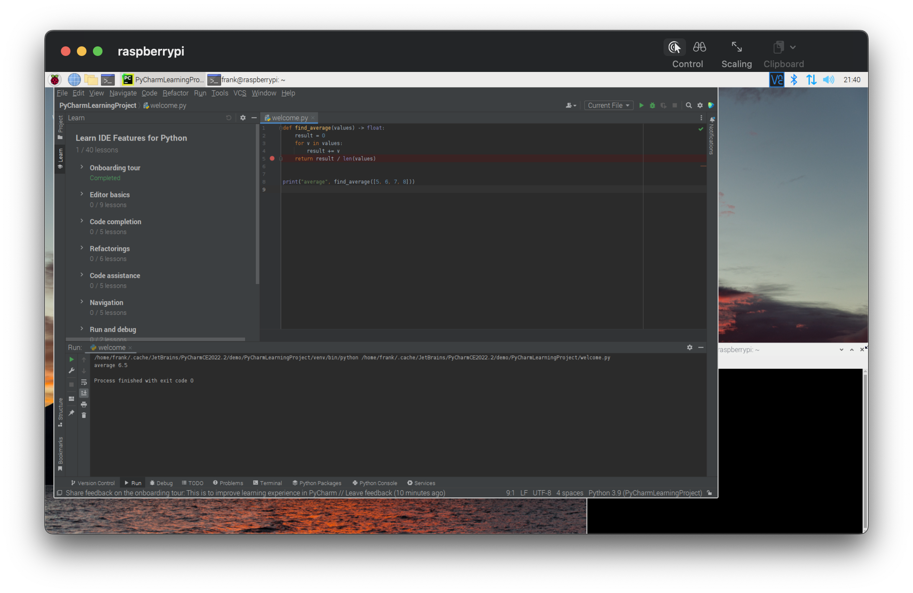

<!--
 * @Author: Frank Chu
 * @Date: 2022-11-29 10:17:13
 * @LastEditors: Frank Chu
 * @LastEditTime: 2022-12-06 11:59:12
 * @FilePath: /EE/Embeded-System/lab05RaspberryPi.md
 * @Description: 
 * 
 * Copyright (c) 2022 by Frank Chu, All Rights Reserved. 
-->

<!-- markdownlint-disable MD033 -->
# <center>实验五 基于Python的树莓派应用</center>

<center>电子信息工程 1 班 姓名: 褚勇  学号: 2020331200003</center>

## 一、实验目的

初步掌握树莓派 GPIO 的 Python 编程，初步了解图像处理和视频处理方法，初步掌握 OpenCV 的使用。

## 二、实验内容

1. 搭建基于 Pycharm 的开发环境并进行代码调试
2. Python 编程实现GPIO控制
3. Python 编程实现运动物体检测

## 三、实验设备及工具

* 硬件：电脑、树莓派
* 软件：OpenCV

## 四、实验原理

实验指导书-树莓派版-2022

## 五、实验步骤及结果

### 1. 搭建基于 PyCharm 的开发环境并进行代码调试



```sh
# How to install the PyCharm on the Raspberry pi operating system
# https://linuxhint.com/install-pycharm-raspberry-pi/

sudo apt update && sudo apt full-upgrade -y

# Download on https://www.jetbrains.com/pycharm/download/#section=linux   
tar xvf {{YOUR-DOWNLOADS-DIRECTORY}}/pycharm-community-{{DATE-VERSION}}.tar
# - E[x]tract a (compressed) archive [f]ile into the current directory [v]erbosely:

# The PyCharm package is dependent on the Java, 
# so we have to install the Java package to use the PyCharm, 
# for this we use the following command for the installation of the PyCharm:
sudo apt install openjdk-11-jdk

pycharm-community-{{DATE-VERSION}}/bin/pycharm.sh
```

### 2. Python 编程实现 GPIO 控制

> ChatGPT
>
> To control the GPIO pins on a Raspberry Pi using Python, you need to install the RPi.GPIO library. This library provides a simple interface for controlling the GPIO pins on the Raspberry Pi.

```bash
# https://raspberrypi.stackexchange.com/questions/40105/access-gpio-pins-without-root-no-access-to-dev-mem-try-running-as-root
# Access GPIO pins without root. No access to /dev/mem. Try running as root!
sudo rpi-update

# to make sure you are using a recent kernel, and
sudo apt-get update
sudo apt-get upgrade

# i is in lower case
sudo pip install RPi.GPIO

sudo python
```

> ChatGPT Generative Pre-Trained Transformer
>
> Once the library is installed, you can use it to control the GPIO pins in your Python scripts. To do this, you will need to import the RPi.GPIO library at the beginning of your script:

```py
import RPi.GPIO as GPIO

# Set the numbering scheme for the GPIO pins
GPIO.setmode(GPIO.BCM)

# Configure the GPIO pin as an output
GPIO.setup(2, GPIO.OUT)

# Write a high (1) or low (0) value to the GPIO pin
GPIO.output(2, 1)

# Print the state of the GPIO pins
GPIO.input(2)
```

### 3. Python 编程实现运动物体检测


简要实现步骤：

1. 读入摄像头
2. 运动物体检测
3. 显示视频

Python 编程实现步骤

1. 创建一个去除背景的对象，`bs = cv2.createBackgroundSubtractorMOG2()`。
2. 用 `cap = cv2.VideoCapture()` 启用摄像头.
3. 用循环读取视频流的每一帧并应用背景 Subtractor, `bs.apply()` 方法。之后会创建一个运动物体的遮罩，运动的物体会显示出来。
4. 用 `cv2.threshold()` 函数去二值化运动遮罩并创建一个 binary image，图片中仅包含，黑白像素，白色是运动物体，黑色是背景。
5. 使用 `cv2.findContours()` 函数在二值图像中查找轮廓。这将返回一个轮廓列表，其中每个轮廓都以点集表示。
6. 遍历轮廓，用 `cv2.contourArea()` 函数找到面积最大的轮廓。这将是视频流截取的图像中主要移动的对象。
7. 使用 `cv2.boundingRect()` 函数找到主轮廓周围的边界框。这将为您提供矩形左上角的坐标及其宽度和高度。
8. 使用 `cv2.rectangle()` 函数围绕帧中最大的移动对象绘制方形轮廓。要使轮廓成为正方形，请使用边界框的宽度或高度（以较大者为准）作为矩形每条边的长度。
9. 使用 `cv2.imshow()` 函数显示原始帧和轮廓。
10. 完成之后按 `q` 退出。

Name Explaination

* bs: Background Subtractor
* cap: Capture

> Answer by ChatGPT
>
> To detect moving objects in Python, you can use the OpenCV library. OpenCV is a popular library for computer vision tasks, and it includes a number of functions and algorithms for detecting and tracking objects in video streams.
>
> To use OpenCV in Python, you will need to install the opencv-python package. You can do this using the pip package manager by running the following command in a terminal:

```bash
pip install opencv-python
pip install numpy
pip install -U numpy
# https://stackoverflow.com/questions/53347759/importerror-libcblas-so-3-cannot-open-shared-object-file-no-such-file-or-dire
# ImportError: libcblas.so.3: cannot open shared object file: No such file or directory
sudo apt-get install libatlas-base-dev
```

```py
# Once the opencv-python package is installed, you can import it in
# your Python scripts and use its functions and classes. 
# To detect moving objects in a video stream, you can use the 
# cv2.BackgroundSubtractorMOG2 class. This class provides 
# an implementation of the background subtraction algorithm, 
# which can be used to segment moving objects from the 
# static background in a video stream.

# cv2.BackgroundSubtractorMOG2 usage to detect moving objects in a video stream

# https://docs.opencv.org/3.4/d7/d7b/classcv_1_1BackgroundSubtractorMOG2.html
# cv::BackgroundSubtractorMOG2 Class Reference
# Mixture of Gaussian
# Gaussian Mixture-based Background/Foreground Segmentation Algorithm
import cv2

# Create a BackgroundSubtractorMOG2 object
# The full name of MOG2 in OpenCV is "Background Subtractor MOG2". MOG2 is a type of background subtraction algorithm that can be used in computer vision tasks to separate foreground objects from the background. It is part of the OpenCV library, which is a collection of algorithms and functions for computer vision and machine learning tasks. MOG2 is an updated version of the original MOG algorithm, and it is more effective at removing background noise and detecting moving objects.

# Create a background subtractor object
bs = cv2.createBackgroundSubtractorMOG2()

# Capture video from your Mac's camera
cap = cv2.VideoCapture(0)

while True:
    # Read the next frame from the video stream
    _, frame = cap.read()

    # Use the background subtractor to detect motion in the frame
    fgmask = bs.apply(frame)

    # Convert the motion mask to a binary image
    thresh = cv2.threshold(fgmask, 25, 255, cv2.THRESH_BINARY)[1]

    # Find the contours in the binary image
    contours, _ = cv2.findContours(thresh, cv2.RETR_EXTERNAL, cv2.CHAIN_APPROX_SIMPLE)

    # Find the contour with the largest area
    main_contour = None
    main_contour_area = 0
    for c in contours:
        area = cv2.contourArea(c)
        if area > main_contour_area:
            main_contour = c
            main_contour_area = area

    # Draw a contour around the main moving object
    if main_contour is not None:
        # cv2.drawContours(frame, [main_contour], 0, (0, 255, 0), 2)
        x, y, w, h = cv2.boundingRect(main_contour)
        side = max(w, h)
        cv2.rectangle(frame, (x, y), (x+side, y+side), (0, 255, 0), 2)


    # Display the original frame and the contour
    cv2.imshow('Frame', frame)
    cv2.imshow('Contours', thresh)

    # Check if the user pressed the 'q' key
    key = cv2.waitKey(30) & 0xff
    if key == ord('q'):
        break

# Release the video capture and destroy all windows
cap.release()
cv2.destroyAllWindows()
```

## 六、实验中碰到的问题及解决方案，总结

实验中有很多细节不是很了解，因此，接触了 OpenAI 的 ChatGPT 去寻找相关答案，非常高效，很好的了解到了树莓派 Python 编程的细节。
