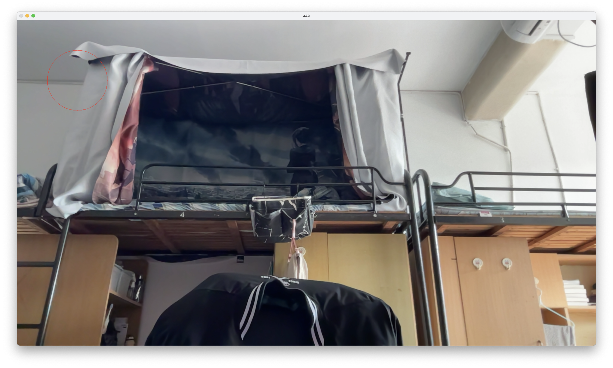
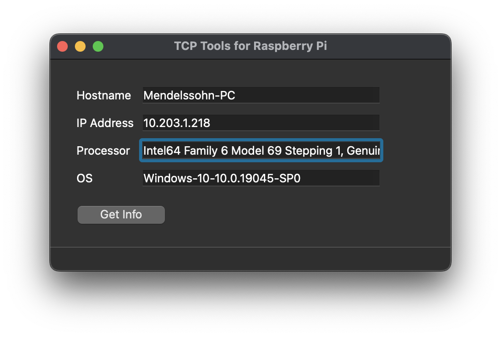

<!--
 * @Author: Frank Chu
 * @Date: 2022-11-29 10:17:13
 * @LastEditors: Frank Chu
 * @LastEditTime: 2022-12-13 13:01:30
 * @FilePath: /EE/Embeded-System/lab06-Project.md
 * @Description: 
 * 
 * Copyright (c) 2022 by Frank Chu, All Rights Reserved. 
-->

<!-- markdownlint-disable MD033 -->
# <center>实验六 树莓派综合</center>

<center>电子信息工程 1 班 姓名: 褚勇  学号: 2020331200003</center>

## 一、实验目的

* 学习网络编程方法
* 基于树莓派和摄像头，通过 Python 语言和 OpenCV 编程实现运动物体检测
* 掌握 PyQt 的使用

## 二、实验内容

1. Python抓视频，做简单处理
2. 运动物体检测
3. 网络编程
4. 界面编程

## 三、实验设备及工具

* 硬件：电脑、树莓派
* 软件：OpenCV

## 四、实验原理

实验指导书-树莓派版-2022

## 五、实验步骤及结果

### 1. Python 抓视频，做简单处理

在画面的左上角绘制一个红色的圈圈，下图为添加视频图标，视频拍摄过程中呈现图标。




```py
import cv2 

# cv2.VideoCapture(0), 0 is the default camera
cap = cv2.VideoCapture(0)

print("VideoCapture is opened?", cap.isOpened)

while(True):

    # _, frame = cap.read()
    _, frame = cap.read() 
    center = (frame.shape[1]//2, frame.shape[0]//2)

    gray = cv2.cvtColor(frame, cv2.COLOR_BGR2GRAY) 
    cv2.circle(frame, center=(200, 200), radius=100, color=(0,0,255))

    # Display the original frame and the contour
    # cv2.imshow('Frame', frame)
    # cv2.imshow('Contours', thresh)
    cv2.namedWindow("aaa",0) 
    cv2.imshow("aaa", frame)

    # Check if the user pressed the 'q' key
    # key = cv2.waitKey(30) & 0xff
    # if key == ord('q'):
    #     break
    if cv2.waitKey(1) & 0xFF == ord('q'):
        break

cap.release() 
cv2.destroyAllWindows()

```

### 2. Python 编程实现运动物体检测


简要实现步骤：

1. 读入摄像头
2. 运动物体检测
3. 显示视频

Python 编程实现步骤

1. 创建一个去除背景的对象，`bs = cv2.createBackgroundSubtractorMOG2()`。
2. 用 `cap = cv2.VideoCapture()` 启用摄像头.
3. 用循环读取视频流的每一帧并应用背景 Subtractor, `bs.apply()` 方法。之后会创建一个运动物体的遮罩，运动的物体会显示出来。
4. 用 `cv2.threshold()` 函数去二值化运动遮罩并创建一个 binary image，图片中仅包含，黑白像素，白色是运动物体，黑色是背景。
5. 使用 `cv2.findContours()` 函数在二值图像中查找轮廓。这将返回一个轮廓列表，其中每个轮廓都以点集表示。
6. 遍历轮廓，用 `cv2.contourArea()` 函数找到面积最大的轮廓。这将是视频流截取的图像中主要移动的对象。
7. 使用 `cv2.boundingRect()` 函数找到主轮廓周围的边界框。这将为您提供矩形左上角的坐标及其宽度和高度。
8. 使用 `cv2.rectangle()` 函数围绕帧中最大的移动对象绘制方形轮廓。要使轮廓成为正方形，请使用边界框的宽度或高度（以较大者为准）作为矩形每条边的长度。
9. 使用 `cv2.imshow()` 函数显示原始帧和轮廓。
10. 完成之后按 `q` 退出。

Name Explaination

* bs: Background Subtractor
* cap: Capture

> Answer by ChatGPT
>
> To detect moving objects in Python, you can use the OpenCV library. OpenCV is a popular library for computer vision tasks, and it includes a number of functions and algorithms for detecting and tracking objects in video streams.
>
> To use OpenCV in Python, you will need to install the opencv-python package. You can do this using the pip package manager by running the following command in a terminal:

```bash
pip install opencv-python
pip install numpy
pip install -U numpy
# https://stackoverflow.com/questions/53347759/importerror-libcblas-so-3-cannot-open-shared-object-file-no-such-file-or-dire
# ImportError: libcblas.so.3: cannot open shared object file: No such file or directory
sudo apt-get install libatlas-base-dev
```

```py
# Once the opencv-python package is installed, you can import it in
# your Python scripts and use its functions and classes. 
# To detect moving objects in a video stream, you can use the 
# cv2.BackgroundSubtractorMOG2 class. This class provides 
# an implementation of the background subtraction algorithm, 
# which can be used to segment moving objects from the 
# static background in a video stream.

# cv2.BackgroundSubtractorMOG2 usage to detect moving objects in a video stream

# https://docs.opencv.org/3.4/d7/d7b/classcv_1_1BackgroundSubtractorMOG2.html
# cv::BackgroundSubtractorMOG2 Class Reference
# Mixture of Gaussian
# Gaussian Mixture-based Background/Foreground Segmentation Algorithm
import cv2

# Create a BackgroundSubtractorMOG2 object
# The full name of MOG2 in OpenCV is "Background Subtractor MOG2". MOG2 is a type of background subtraction algorithm that can be used in computer vision tasks to separate foreground objects from the background. It is part of the OpenCV library, which is a collection of algorithms and functions for computer vision and machine learning tasks. MOG2 is an updated version of the original MOG algorithm, and it is more effective at removing background noise and detecting moving objects.

# Create a background subtractor object
bs = cv2.createBackgroundSubtractorMOG2()

# Capture video from your Mac's camera
# cv2.VideoCapture(0), 0 is the default camera
cap = cv2.VideoCapture(0)

while True:
    # Read the next frame from the video stream
    _, frame = cap.read()

    # Use the background subtractor to detect motion in the frame
    fgmask = bs.apply(frame)

    # Convert the motion mask to a binary image
    thresh = cv2.threshold(fgmask, 25, 255, cv2.THRESH_BINARY)[1]

    # Find the contours in the binary image
    contours, _ = cv2.findContours(thresh, cv2.RETR_EXTERNAL, cv2.CHAIN_APPROX_SIMPLE)

    # Find the contour with the largest area
    main_contour = None
    main_contour_area = 0
    for c in contours:
        area = cv2.contourArea(c)
        if area > main_contour_area:
            main_contour = c
            main_contour_area = area

    # Draw a contour around the main moving object
    if main_contour is not None:
        # cv2.drawContours(frame, [main_contour], 0, (0, 255, 0), 2)
        x, y, w, h = cv2.boundingRect(main_contour)
        side = max(w, h)
        cv2.rectangle(frame, (x, y), (x+side, y+side), (0, 255, 0), 2)


    # Display the original frame and the contour
    cv2.imshow('Frame', frame)
    cv2.imshow('Contours', thresh)

    # Check if the user pressed the 'q' key
    key = cv2.waitKey(30) & 0xff
    if key == ord('q'):
        break

# Release the video capture and destroy all windows
cap.release()
cv2.destroyAllWindows()
```

### 3. 网络编程

[Python 网络编程](https://www.runoob.com/python/python-socket.html)

Python 提供了两个级别访问的网络服务：

* 低级别的网络服务支持基本的 Socket，它提供了标准的 BSD Sockets API，可以访问底层操作系统 Socket 接口的全部方法。
* 高级别的网络服务模块 SocketServer， 它提供了服务器中心类，可以简化网络服务器的开发。

Socket又称"套接字"，应用程序通常通过"套接字"向网络发出请求或者应答网络请求，使主机间或者一台计算机上的进程间可以通讯。

Python 提供了一些内置模块来实现网络通信，包括用于 TCP 网络通信的 socket 模块。下面是一个简单的 Python 程序，实现了一个客户端和一个服务器端，使用 TCP 协议进行网络通信。

```bash
# 允许接入对应的端口
sudo vim /etc/pf.conf
rdr pass on lo0 inet proto tcp from any to any port 12345
```

```py
# Server
# 导入 socket、sys 模块
import socket

# 创建 socket 对象
serversocket = socket.socket()

# 获取本地主机名
host = socket.gethostname()

# 设置端口
port = 12345

# 绑定端口
serversocket.bind((host, port))

# 设置最大连接数，超过后排队
serversocket.listen(5)

while True:
    # 建立客户端连接
    clientsocket, addr = serversocket.accept()

    # % 7.1.4. 旧式字符串格式化方法
    # % 运算符（求余符）也可用于字符串格式化。给定 'string' % values，则 string 中的 % 实例会以零个或多个 values 元素替换。此操作被称为字符串插值。例如：
    # >>>
    # >>> import math
    # >>> print('The value of pi is approximately %5.3f.' % math.pi)
    # The value of pi is approximately 3.142.
    # printf 风格的字符串格式化 小节介绍更多相关内容。
    print("连接地址：%s" % str(addr))

    msg = '成功连接到服务器，欢迎！' + "\r\n"
    clientsocket.send(msg.encode('utf-8'))
    clientsocket.close()
```

```py
# client
# 导入 socket 模块
import socket

# 创建 socket 对象
s = socket.socket()

# 获取本地主机名或者填入主机名/IP地址
host = socket.gethostname()

# 设置端口
port = 12345

# 连接服务，指定主机和端口
s.connect((host, port))

# 接收小于 1024 字节的数据
msg = s.recv(1024)

s.close()

print(msg.decode('utf-8'))
```

```bash
# 实现笔记本和树莓派之间的文件传输
python -m http.server
```

### 4. 界面编程

[Build a Python GUI App in Apple M1](https://betterprogramming.pub/build-a-python-gui-app-in-apple-m1-e16098112e61)

[mac下Qt缺失libiodbc.2.dylib和libpq.5.dylib解决方案](https://blog.csdn.net/yutianyue126/article/details/106911948)

[OSX开发记录](https://yjdwbj.github.io/2021/05/24/OSX开发记录/)

```bash
pip install PyQt6
pip install PySide6

# Compile and pack all code in a distributable form. 
# People usually call this process Freeze.
pip install --upgrade cx_Freeze

# https://stackoverflow.com/questions/4842448/getting-processor-information-in-python
pip install py-cpuinfo
```

<!-- https://linuxhint.com/center-image-html/ -->
<div style="text-align: center;">
    
</div>

```py
from PySide6.QtWidgets import QApplication,QLabel
app   = QApplication([])
label = QLabel('hello world')
label.show()
app.exec()
```

```bash
# To compile your PyQt application, in your terminal, run:
cxfreeze -c <python file name>.py --target-dir dist
```

<div style="text-align: center;">
    
</div>

<script src="https://gist.github.com/xhinker/40e5a86aab4da296e572daabcbf6b958.js"></script>



#### client code

```py
import socket
import sys
import pickle

class SendInfo:
    def __init__(self, cpu_info, host_name, ip_address, platform_info):
        self.cpu_info = cpu_info
        self.host_name = host_name
        self.ip_address = ip_address
        self.platform_info = platform_info

def connectAndPrint(host_to_connect):
    print("connecting to", host_to_connect)

    with socket.socket() as client_socket:
        client_socket.connect((host_to_connect, 12345))
        
        data = client_socket.recv(4096)
        data_variable = pickle.loads(data)
        
        attributes = vars(data_variable)
        for key, value in attributes.items():
            print(key, ":", value)
    # In Python, the variables inside a with statement will not be destroyed when the with block ends. Instead, the variables will continue to exist in the scope where they were defined, and can be accessed and used after the with block ends.
    return data_variable

if __name__ == "__main__":
    ip_to_connect = sys.argv[1]
    connectAndPrint(ip_to_connect)
```

#### client main

```py
'''
Author: Frank Chu
Date: 2022-12-11 15:08:51
LastEditors: Frank Chu
LastEditTime: 2022-12-11 17:56:34
FilePath: /EE/Embeded-System/pyqt/info_gui.py
Description: 【Python图形界面 15分钟快速入门PySide/PyQt】 
https://www.bilibili.com/video/BV18F411W7y2/?share_source=copy_web&vd_source=bf4952280cde801b178268abc99a7047

Copyright (c) 2022 by Frank Chu, All Rights Reserved. 
'''
from threading import Thread
from PySide6.QtWidgets import QApplication, QMainWindow
# PySide6-uic demo.ui -o ui_demo.py
from ui_info_gui_design import Ui_MainWindow
from info_client import connectAndPrint, SendInfo
from info_mysignal import my_signal

class MainWindow(QMainWindow):
    def __init__(self):
        super(MainWindow, self).__init__()
        self.ui = Ui_MainWindow()
        self.ui.setupUi(self)
        self.bind()
    
    def bind(self):
        # self.ui.hostnameLineEdit.setText("raspberrypi.local")
        self.ui.hostnameLineEdit.setText("frank-parallels-vm.local")
        # self.ui.hostnameLineEdit.setText("10.203.1.120")

        my_signal.setEditLine.connect(self.set_line_edit)
        self.ui.getInfoPushButton.clicked.connect(self.handle_click)
        def inner_thread():
            self.connectToRemote()
        task = Thread(target=inner_thread)
        task.start()
    
    def connectToRemote(self):
        try:
            host = self.ui.hostnameLineEdit.text()
            remote_system_info = connectAndPrint(host_to_connect=host)
            self.set_line_edit(remote_system_info)
        except:
            print("Please input a valid hostname")
    
    def set_line_edit(self, info: SendInfo):
        self.ui.hostnameLineEdit.setText(info.host_name)
        self.ui.ipAddressLineEdit.setText(info.ip_address)
        self.ui.processorLineEdit.setText(info.cpu_info)
        self.ui.osLineEdit.setText(info.platform_info)
        
    
    def handle_click(self):
        def side_thread():
            self.connectToRemote()
        task = Thread(target=side_thread)
        task.start()
        
    
if __name__ == '__main__':
    app = QApplication([])
    window = MainWindow()
    window.show()
    app.exec()
```

#### server code

```py
import socket
import platform
import pickle

host = '0.0.0.0'
port = 12345

class SendInfo:

    def __init__(self, cpu_info, host_name, ip_address, platform_info):
        self.cpu_info = cpu_info
        self.host_name = host_name
        self.ip_address = ip_address
        self.platform_info = platform_info

cpu_info = platform.processor() 
host_name = socket.gethostname()
ip_address = socket.gethostbyname(host_name)
platform_info = platform.platform()

info_to_be_send = SendInfo(cpu_info, host_name, ip_address, platform_info)
# https://stackoverflow.com/questions/15190362/sending-a-dictionary-using-sockets-in-python
data_string = pickle.dumps(info_to_be_send)
print("Please connect to", ip_address)

with socket.socket() as server_socket:
    server_socket.bind((host, port))
    server_socket.listen()

    while True:
         client_socket, address = server_socket.accept()
         client_socket.send(data_string)
```

## 六、实验中碰到的问题及解决方案，总结

本次实验中也有很多不了解的地方，但是均通过在搜索的过程中一一解决，和同学们进行讨论，很好的提高了对于课程的了解。
