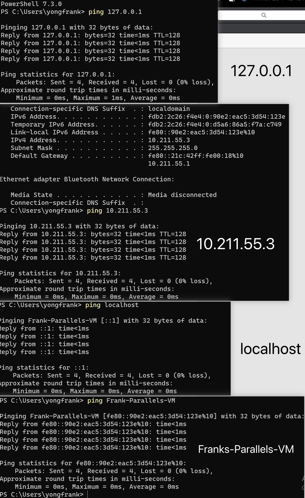
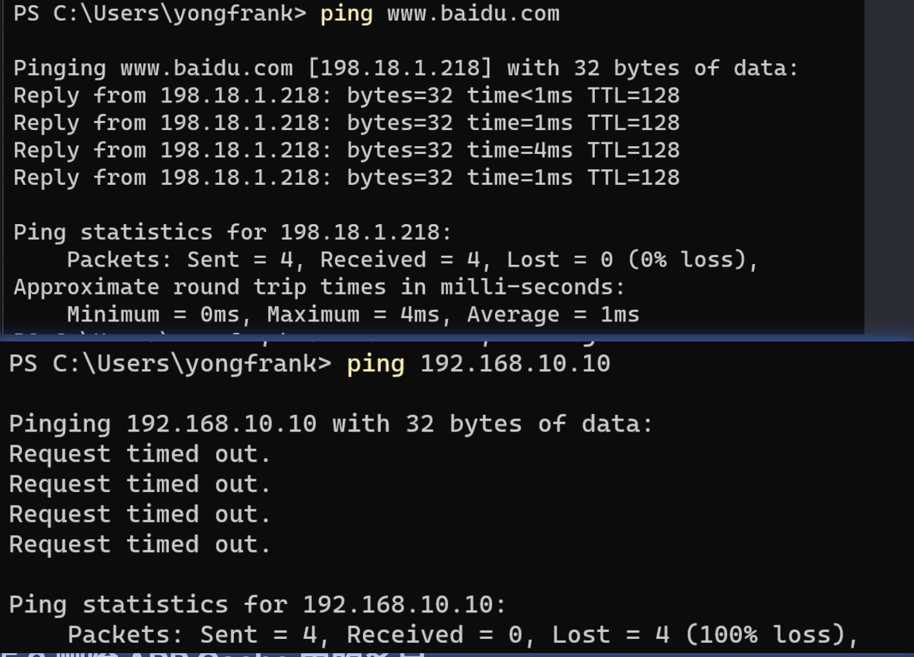
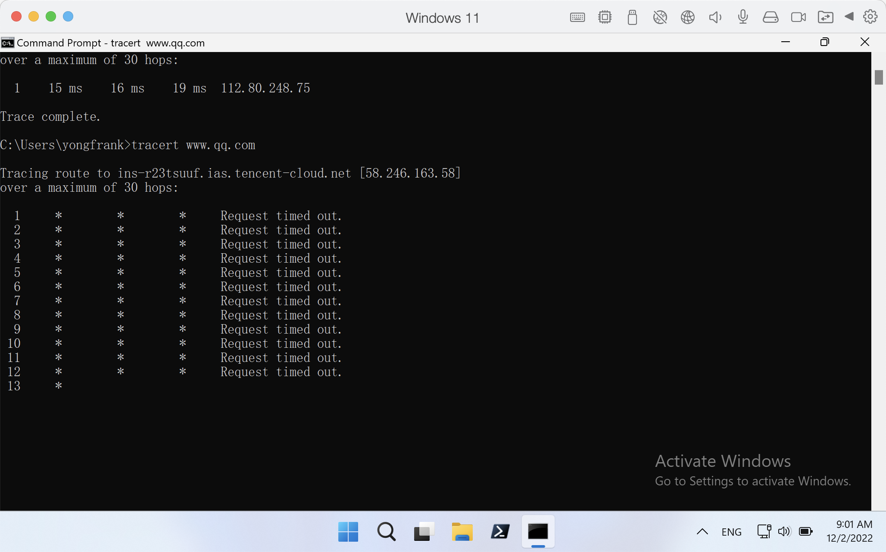
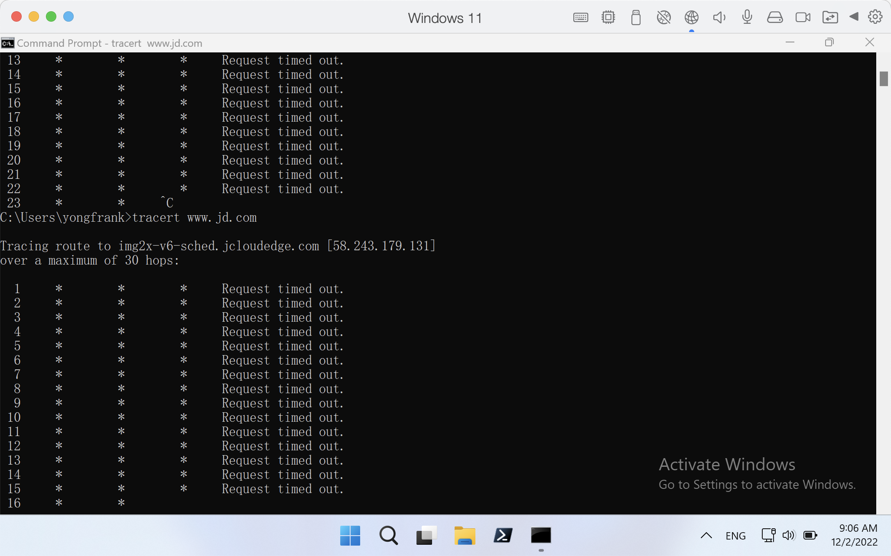
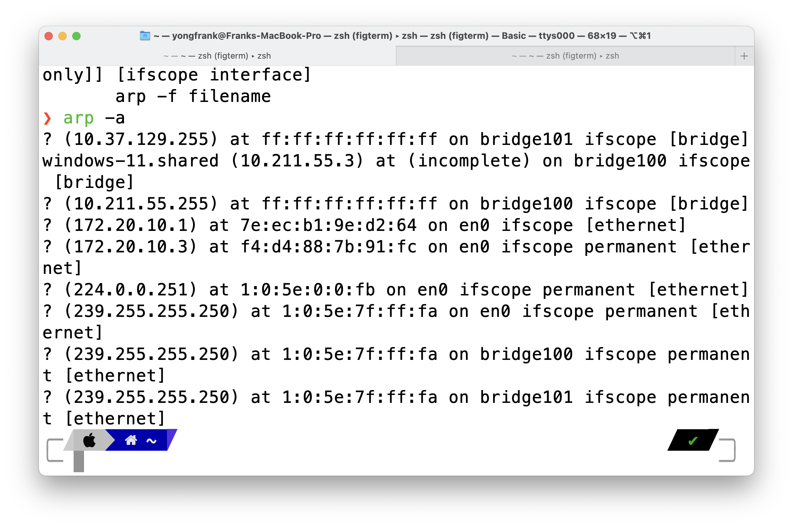
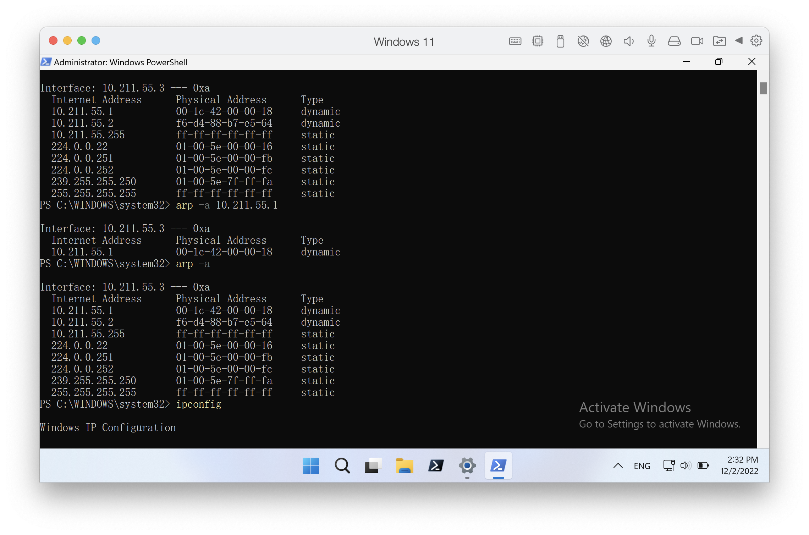
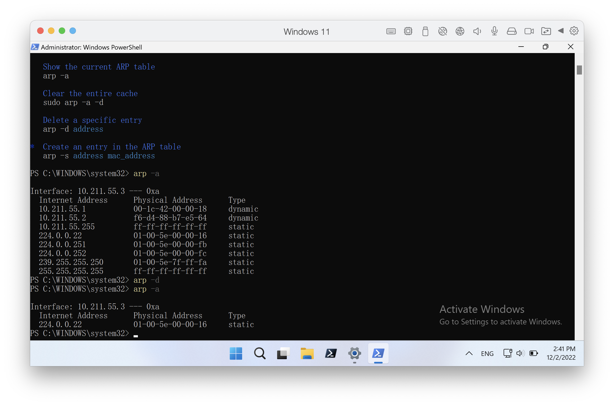

<!--
 * @Author: Frank Chu
 * @Date: 2022-11-25 15:24:59
 * @LastEditors: Frank Chu
 * @LastEditTime: 2022-12-02 14:42:18
 * @FilePath: /undefined/Users/yongfrank/Documents/University/Fa22/周五 12 Network/lab02-Network.md
 * @Description: 
 * 
 * Copyright (c) 2022 by Frank Chu, All Rights Reserved. 
-->

# 实验二 网络基础，网络命令的使用

## 1.1 Open Windows [Command Prompt](https://en.wikipedia.org/wiki/Cmd.exe)

任务要求：

* 打开 Windows 10 的命令(控制台)窗口。
* 请给出其他打开 Windows 10 的命令(控制台)窗口的方法(至少 2 种)。

实验步骤：

* `Win + r` and enter `cmd`
* `Win` and enter `cmd`
* `Windows + x` and click `Command Prompt`
* open `C:\Windows\System32\cmd.exe` 

参考

* 10 Ways to Open the Command Prompt in Windows 10
https://www.howtogeek.com/235101/10-ways-to-open-the-command-prompt-in-windows-10/

## 1.2 Get Host System Info

任务要求：

* 获取主机的基本系统信息，主要包括:主机名、CPU、内存、操作系统类型等。

* 还有哪些方法可以获得 Windows 10 主机的系统信息? 至少给出另外 2 种方法。

Table 1-1 主机基本系统信息

<!-- ||| Method 1| Method 2| Method 3| -->
||||
|-|-|-|
|主机名 Device Name | Frank-Parallels-VM | cmd `hostname` |
|工作组名 Domain | WORKGROUP | `Win` + `Change workgroup name`|
|处理器 Processor | Apple Silicon 3.2 GHz (4 processors) | cmd `wmic cpu get caption, deviceid, name, numberofcores, maxclockspeed, status` |
|内存 Installed RAM | 8.00 GB | cmd `systeminfo` |
|系统类型 System type | 64-bit operating system, ARM-based processor | cmd `systeminfo` |
|安装的网卡数量 Network Card(s) | 2 NIC(s) Installed. | cmd `systeminfo` |

其他方法

* `Win` + `About Your PC`
* `Win` + `System(Control panel)`
* `Win` + `System` + `Domain or workgroup`
* `Win` + `R` enter `msinfo32`
* `Win` + `R` enter `taskmgr`
* cmd `ipconfig /all`

参考

* qiita - wmic command to get system info コマンドでシステムの情報を取得する
https://qiita.com/Yorcna/items/119abffc89d01f67c111
* Stack Overflow - Get CPU Usage from Windows Command Prompt
https://stackoverflow.com/questions/9097067/get-cpu-usage-from-windows-command-prompt
* 如何查看和修改电脑工作组名称
https://www.betaflare.com/5331.html
* `wmic logicaldisk get /?` wmic命令语法十条示例，够用了！
https://www.bilibili.com/video/BV1v94y1R76k/
* How to Find the Physical Memory Available on a System Through the Command Line
https://qualitestgroup.com/insights/technical-hub/how-to-find-the-physical-memory-available-on-a-system-through-the-command-line/
* Get CPU Information via Command Prompt in Windows 10 https://winaero.com/get-cpu-information-via-command-prompt-in-windows-10/
* Get CPU Information via Command Prompt in Windows 10 https://winaero.com/get-cpu-information-via-command-prompt-in-windows-10/
* Which version of Windows operating system am I running? https://support.microsoft.com/en-us/windows/which-version-of-windows-operating-system-am-i-running-628bec99-476a-2c13-5296-9dd081cdd808

## 1.3 Host IP Settings

任务要求：

* 获取和设置主机指定网络连接的 IP 地址等属性。
* 请将自动和手动 IP 设置的结果填入表 1-2 中。

实验步骤:

1. Open Network Connections
   1. `Win` + `View network connections(Control panel)`
   2. open `Control Panel\Network and Internet\Network Connections`
2. Ethernet -> Properties
3. Internet Protocol Version 4 (TCP/IPv4) -> Properties
4. Obtain an IP address automatically / Obtain DNS server address automatically (get IP, Subnet mask, Default gateway, DNS from DHCP Server)
5. Use the following IP address / use the following DNS server address

Table 1-2

||当前 IP 设置 | 自动 IP 设置 | 手动 IP 设置 |
|-|-|-|-|
|设置方式| Obtain an IP address automatically | Obtain an IP address automatically | Use the following IP address |
|IPv4 地址| 10.211.55.3 | 10.211.55.3 | 10.211.55.100 |
|网关 IP 地址| 10.211.55.1 | 10.211.55.1 | 10.211.55.1 |
|首选 DNS IP 地址| 10.211.55.1 | 10.211.55.1 | 10.211.55.1 |
|备选 DNS IP 地址| 10.211.55.1 | 10.211.55.1 | 114.114.114.114 |
|DHCP 地址| 10.211.55.1 | 10.211.55.1 | 10.211.55.1 |

## 2.1 获取本地主机所有网络连接的基本信息

任务要求:

* 获取本地主机的所有网络连接及其 IP 地址等基本信息。 实验步骤
* 你的主机有哪些网络连接?每个网络连接的状态和基本配置分别是什么?请将结果填入表 1-4 中
* cmd `ipconfig`

表 1-4 主机网络连接及基本配置 Windows IP Configuration

|网络连接 1 名称 | Ethernet adapter Ethernet: Parallels VirtIO Ethernet Adapter |
|-|-|
| IPv4 Address | 10.211.55.3 |
| Subnet Mask | 255.255.255.0 |
| Default Gateway | fe80::21c:42ff:fe00:18%10 10.211.55.1 |
| 网络连接 2 名称 | Ethernet adapter Bluetooth Network Connection |
| 媒体状态 Media State | Media disconnected |

## 2.2 获取本地主机所有网络连接的详细信息

任务要求: 

* 获取本地主机的所有网络连接及其详细配置信息。
*  实验步骤 在本地主机的命令提示符下输入以下命令，然后按回车键。 `ipconfig /all`
*  你的主机有哪些网络连接? 每个网络连接的状态和详细配置分别是什么? 请将结里填入表1-5 中。

表 1-5 主机网络连接及详细配置

|主机名 Host Name | Frank-Parallels-VM |
| - | - |
|启用 IP 路由 IP Routing Enabled | No |
| 网络连接 1 名称 | Ethernet adapter Ethernet |
| Physical Address | 00-1C-42-B0-5A-4E |
| DHCP Enabled | Yes |
| Autoconfiguration Enabled | Yes |
| IPv4 Address | 10.211.55.3(Preferred) |
| Subnet Mask | 255.255.255.0 |
| Default Gateway | fe80::21c:42ff:fe00:18%10 10.211.55.1 |
| DHCP Server | 10.211.55.1 |
| DNS Servers | fe80::21c:42ff:fe00:18%10 10.211.55.1 |
| 网络连接 2 名称 | Ethernet adapter Bluetooth Network Connection |
| Media State | Media disconnected |
| Connection-specific DNS Suffix | |
| Description | Bluetooth Device (Personal Area Network) |
| Physical Address | BC-9A-78-56-34-12 |
| DHCP Enabled | Yes |
| Autoconfiguration Enabled | Yes |

## 2.3 释放和更新自动分配的主机 IPv4 地址

如果你想更换 DHCP 自动分院的 IP 地址，或者在释放了 DHCP 分 配的 IP 地址后，想从 DHCP 重新获得一个 IP 地址，可以使用/renew 选项。

任务要求:

* 释放和更新由 DHCP 自动分配的 IPv4 地址。
* `ipconfig /release "Local Area Connection 2"`
* 命令成功执行完毕后，该网絡连接的IP地址是多少?通过该网络连接，主机还能访问网络吗?
* `ipconfig /renew "Local Area Connection 2"`
* 将你主机上某个网络连接的 TCP/IPv4 属性设置为“自动获得 IP 地址”，记录所分配的 IPv4地址。然后，更新该网络连接的 IPv4 地址。请将重断分配前后的 IP 设置填入表 1-6 中。
* [更新后的 IP 地址与更新前的 IP 地址相同还是不同?]

`/release` 后不能访问网络，没有 IP 地址。

Table 1-6 更新主机 IP 配置

|网络连接名称|||
|-|-|-|
|  | 更新前 | 更新后 |
| IPv4 Address | 10.211.55.3 | 10.211.55.3 |
| Subnet Mask | 255.255.255.0 | 255.255.255.0 |
| Default Gateway | fe80::21c:42ff:fe00:18%10 10.211.55.1 | fe80::21c:42ff:fe00:18%10 10.211.55.1 |

## 3.1 测试本地主机的 IP 设置是否正确

ping 是最常用的网络命令之一，用于在 IP 层测试和诊断主机的网络连通性、可达性、网络延迟和域名解析等。如果 ping 成功(即收到了应答，且无分组丢失或丢失率很低)，说明网络连接配置正确、网络连通、主机工作且可达、域名解析工作正常。如果 ping 失败(例如超时、分组丢失较多等)，则说明存在问题。此时，需要进一步进行测试，并分析失败的原因。

ping 使用 ICMP (Internet Control Message Protocol) 生成请求并处理应答。运行 ping 命令时，ping 发送 ICMP echo 请求消息到另一台主机，并等待 ICMP echo 应答消息。若收到 ICMP echo 应答消息，则显示接收的 ICMP echo 应答消息，计算往返时间和发送、接收和丢失的报文 数。从本地设备发送请求到接收到应答之间的往返时间被称为 ping 时间。

任务要求:

* 测试本地主机的 IP 设置是否正确。
* 按地址 127.0.0.1 测试地址 127.0.0.1 为环回(Loopback) 地址，通常用于“本机”的测试。在本地主机的提示符下输入以下命令，然后按回车键。`ping 127.0.0.1`
* 请将"ping 127.0.0.1”结果的屏幕截图保存到实验报告中。
* 请将"ping 本地主机配置的 IP 地址”结果的屏幕截图保存到实验报告中。
* 请将“ping localhost" 结果的屏幕截图保存到实验报告中
* 命令“ping localhost'"与"ping 127.0.0.1”的结果有何不同: Reply from 不同
* 请将“ping 主机名”结果的屏幕截图保存到实验报告中。
* 命令“ping 主机名”与“ping localhost" 的结果有何不同? Reply from 不同
* 主机名对应的 IP 地址是什么?与配置的 IP 地址一致吗?请将结果填入表 1-8 中。

Table 1-8 主机名及其 IP 地址

|主机名|配置的 IP 地址 | ping 结果中的 IP 地址 | IP 地址是否一致 |
|-|-|-|-|
| Franks-Parallels-VM | fe80::21c:42ff:fe00:18%10 10.211.55.3 | fe80::21c:42ff:fe00:18%10 | 一致 |

## 3.2 测试本地主机是否正确接入网络

任务要求

* 测试本地主机是否正确接入本地网络或互联网。
* 请将“ping 某台主机或网站的 IP 地址”结果的屏幕截图保存到实验报告中
* 请将"ping www.baidu.com "结果的屏幕截图保存到实验报告中。
* 该主机名或网站域名及其 IP 地址分别是什么?请将结果填入表 1-9 中
* 如果你 ping 一个不存在的 IP 地址，例如 192.168.10.10, 屏幕会显示什么结果?
* 这样的结果意味着什么 Request timed out. `Packets: Sent = 4, Received = 0, Lost = 4 (100% loss)`

Table 1-9 主机名或网站域名及其 IP 地址

| 主机名或网站域名 | IP 地址 |
| - | - |
| baidu.com | 110.242.68.66 |
| google.com | 142.250.186.174 |

## 3.3 测量网络延迟

ping 命令不仅可以验证网络的连通性和可达性，还可以提供 ICMP 组从源主机到达目的主机、再从目的主机返回到源主机的往返时间。通过测试连接在不同网络设备上或位于不同网络、网段上的不同主机，并比较它们的往返时间，有助于确定网络延迟以及网络性能瓶颈。

任务要求

* 使用 ping 命令测量和分析本地主机到本地网络或互联网的网络延迟。
* `/n count按 # <count>规定的次数 ping.默认值为 4. Count 为要发送的回显请求数。`
* 分析网络延迟，把结果填入表 1.10 中
* 请分析网络延迟与地理位置的关系，越近的地方，网络延迟越低

||IPv4 地址|最小延迟(ms)|最大延迟(ms)|平均延迟(ms)|网站地理位置|
|-|-|-|-|-|-|
|www.arin.net|192.136.136.47|0ms|8ms|1ms|美国弗吉尼亚阿什本|
|www.lacnic.net|200.3.14.10|0ms|5ms|1ms|巴西圣保罗圣保罗|
|www.afrinic.net| 196.216.2.6 |0ms|7ms|1ms|南非约翰内斯堡约翰内斯堡|
|www.apnic.net| 104.18.236.68 |0ms|18ms|2ms|美国 CloudFlare 节点|
|www.ip.cn| 172.67.135.10 |0.1ms|0.9ms|0.46ms|美国加利福尼亚旧金山 CloudFlare 节点 |

## 4.1 跟踪到不同网站的路由

实验目的

1. 掌握 tracert 命令及其用途，理解输入参数和输出结果。
2. 掌握利用 tracert 命令测试和分析主机的网络连通性、网络延迟。城名解析、跟踪网络路由 的方法，具备基本的检错和排错能力。

tracert 也被称为路由跟踪实用程序，用于跟踪源主机到目的主机之间的路由，检测网络延迟。 ping 可以测试数据是否能到达目的主机，以及到达目的主机的延迟和 TTL,但未给出数据到 达目的主机的路径。tracert 则给出了更为详细的信息，它显示数据从源主机到目的主机的 路由和延迟，包括经过了哪些路由器和到达每台路由器的延迟，所以，tracert 不仅能测量 延迟，还能定位延迟，有助于确定产生网络延迟或发生故障的网络(或链路)和路由器。

tracert 通常与 ipconfig. ping. netstat. nslookup 等配合使用。

[利用指令 ( ping、tracert ) 測試連線趨勢註冊伺服器](https://helpcenter.trendmicro.com/zh-tw/article/tmka-08254/)

任务要求

跟踪和分析本地主机到互联网上不同网站的路由。

实验步骤

* 步骤 1:跟踪到网站 www.qq.com 的路由确认你的计算机已经连入互联网。
* 步骤 2:跟踪到网站 ww.jd.om 的路由

1. 在本地主机的命令提示符下输入以下命令，然后按回车键。 `tracert www.qq.com`
2. 在本地主机的命令提示符下输入以下命令，然后按回车键。 `tracert -d www.qq.com`

表 1-13 跟踪到网站 www.qq.com 的路由

| 目标名称 | |
|-|-|
| 本地主机的 IP 地址 | 10.98.239.85 |
| 本地主机默认网关的 IP 地址| 10.98.0.1 |
| 目标的 IP 地址 | 58.246.163.58 |
| 经过的路由器数量 | Request time out. |
| 第 1 个路由器 IP 地址 | Request time out. |
| 第 2 个路由器 IP 地址 | Request time out. |
| 到达目标的最后一个路由器的 IP 地址 | Request time out. |
| 除去请求超时的路由器，哪个 或哪些路由器的网络延迟最大? 请技延迟从大到小顺序给 出最多 3 个路由器在结果中的 序号、IP 地址和延迟 | Request time out. |

| 序号 | IP 地址 | 延迟(ms) |
| - | - | - |
| Request time out. | * | * |
| Request time out. | * | * |
| Request time out. | * | * |

表 1-14 路由器地理位置

| 序号 | 路由器 IP 地址 | 地理位置(国家，省市，区域) |
| - | - | - |
| Request time out. | * | * |
| Request time out. | * | * |
| Request time out. | * | * |

表 1-15 跟踪到网站 www.jd.com 的路由

| 目标名称 | |
|-|-|
| 本地主机的 IP 地址 | 10.98.239.85 |
| 本地主机默认网关的 IP 地址| 10.98.0.1 |
| 目标的 IP 地址 | 58.246.163.58 |
| 经过的路由器数量 | Request time out. |
| 第 1 个路由器 IP 地址 | Request time out. |
| 第 2 个路由器 IP 地址 | Request time out. |
| 到达目标的最后一个路由器的 IP 地址 | Request time out. |
| 除去请求超时的路由器，哪个 或哪些路由器的网络延迟最大? 请技延迟从大到小顺序给 出最多 3 个路由器在结果中的 序号、IP 地址和延迟 | Request time out. |

| 序号 | IP 地址 | 延迟(ms) |
| - | - | - |
| Request time out. | * | * |
| Request time out. | * | * |
| Request time out. | * | * |

表 1-16 路由器地理位置

| 序号 | 路由器 IP 地址 | 地理位置(国家，省市，区域) |
| - | - | - |
| Request time out. | * | * |
| Request time out. | * | * |
| Request time out. | * | * |

表 1-17 路由相同的路由器

| 步骤 2 路由器 IP 地址 | 序号 | 步骤 1 路由器 IP 地址 |
| - | - | - |
| Request time out. | * | Request time out. |
| Request time out. | * | Request time out. |
| Request time out. | * | Request time out. |

## 5.1 查看 ARP Cache 内容

实验目的

1. 掌握 arp 命令及其用途。
2. 掌握利用 arp 命令管理和分析 ARP 高速缓存(ARP Cache)的方法，具备基络管理、检错和 排错能力。

实验原理(背景知识)

arp 命令与 ARP 协议有关，但不要混淆 arp 命令和 ARP 协议。

ARP 协议(Address Resolution Protocol, 地址解析协议)用于将网络层(第 3 层)地址映射到数据链路层(第 2 层)的 MAC 地址。

为了找到目的 IP 地址对应的 MAC 地址设备在其本地网络上 广播发送 ARP 请求，拥有该 IP 地址的设备收到 ARP 请求后，用其地址进行 ARP 响应。收到 ARP 请求和 ARP响应的设备将 IP 地址和其对应的 MAC 地址映射保存在被称为 ARP 高速缓存(ARP Cache)的 ARP 表中。

ARP Cache 的大小是有限的，所保存的 IP 地址和 MAC 地址映射条目被定期清除。每个条目都有一个生存期，生存期只有几分钟。ARP Cache 定时器会清除已经到期的条目。定期清除允许设备适应 IP 地址或 MAC 地址的变化。ARP Cache 中的 条目有两种类型:静态和动态。静态条目是手工写入的，动态条目是由 ARP 协议写入的，会被定期删除。

arp 命令用于查看、添加、修改和删除 ARP Cache 中的内容。

将“arp-a”结果中某个接口 ARP Cache 内容的屏幕截图保存到实验报告中

实验步骤

1. 步骤 1: 查看 ARPCache 中的内容
2. 步骤 2: 查看 ARPCache 中某个 IP 地址的条目

表 1-19 输出结果

| 默认网关 IP 地址 | MAC 地址 | 类型 | 网络接口索引号 |
|-|-|-|-|
| 10.211.55.3 | 00-1c-42-00-00-18 | Dynamic | ? |

## 5.2 删除 ARP Cache 中的条目

* 步骤 1:查看 ARPCache 中的条目
* 步骤 2:删除 ARP Cache 中的所有条目

在本地主机的命令提示符下输入以下命令，然后按回车键。

`arp -d`

检查删除结果。在本地主机的命令提示符下输入以下命令，然后按回车键。

`arp -a`

