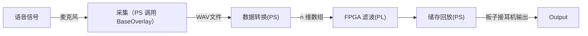

<!--
 * @Author: Frank Chu
 * @Date: 2022-12-07 15:03:30
 * @LastEditors: Frank Chu
 * @LastEditTime: 2022-12-10 16:54:59
 * @FilePath: /EE/Xilinx-PYNQ-Z2/README.md
 * @Description: 
 * 
 * Copyright (c) 2022 by Frank Chu, All Rights Reserved. 
-->

# PYNQ-Z2

PYNQ-Z2 是一款 FPGA 开发板，具有双核 ARM Cortex-A9 处理器和 Xilinx ZYNQ-7000 FPGA 芯片。PYNQ-Z2 是一款高性能的 FPGA 开发板，可用于各种应用场景，包括视觉处理、信号处理、通信和网络等。

PYNQ-Z2 的设计基于 PYNQ 框架，支持使用 Python 语言进行 FPGA 设计和编程。PYNQ 框架可以简化 FPGA 设计流程，使用户可以轻松地利用 FPGA 的高性能，实现复杂的计算任务。PYNQ-Z2 还提供了丰富的资源和支持，包括各种硬件资源、软件库和教程，可以帮助用户使用 PYNQ-Z2 开发 FPGA 应用。PYNQ-Z2 还支持使用 Jupyter Notebook 进行 FPGA 开发，可以在交互式环境中进行设计和测试。

PYNQ-Z2 的主要优势在于提供了一个简单易用的开发环境，可以让用户更快地完成 FPGA 应用的开发。PYNQ-Z2 拥有高性能的 FPGA 芯片和双核处理器，可以满足各种复杂的计算需求。同时，PYNQ-Z2 还提供了丰富的资源和支持，可以帮助用户快速上手并完成 FPGA 应用的开发。

## 语音信号处理流程



## Software

* Vivado 2019.1
* Vivado HLS
* Jupyter NoteBook (PS: Processing System)
* Vivado / Vivado HLS (PL: Programmable Logic)

## PYNQ-Z2 的主要特性

* 双核 ARM Cortex-A9 处理器
* Xilinx ZYNQ-7000 FPGA 芯片

# 作业

## 1. 什么是语谱图

[现代语音信号处理之语谱图（spectrogram）-CSDN](https://blog.csdn.net/weixin_42788078/article/details/102464278)

语谱图（Spectrogram）是一种表示声音信号频谱变化的图表，通常用于分析语音信号。语谱图通常用灰度图表示，横轴表示时间，纵轴表示频率，灰度值表示信号在该时间和频率下的幅度。语谱图可以帮助我们更直观地理解声音信号的频谱变化，有助于语音信号的处理和分析。

语谱图就是语音频谱图，一般是通过处理接收的时域信号得到频谱图，因此只要有足够时间长度的时域信号就可。（时间长度为保证频率分辨率）

专业点讲，那是频谱分析视图，如果针对语音数据的话，叫语谱图。语谱图的横坐标是时间，纵坐标是频率，坐标点值为语音数据能量。由于是采用二维平面表达三维信息，所以能量值的大小是通过颜色来表示的，颜色深，表示该点的语音能量越强。

语谱图还分为窄带语谱图和宽带语谱图。

“窄带”，顾名思义，带宽小，则时宽大，则短时窗长，窄带语谱图就是长窗条件下画出的语谱图。“宽带”，正好相反。至于“横竖条纹”，窄带语谱图的带宽窄，那么在频率上就“分得开”，即能将语音各次谐波“看得很清楚”，即表现为“横线”。“横”就体现出了频率分辨率高。分辨率可以直观的看做“分开能力”。“频率分辨率”高就是在频率上将各次谐波分开的能力高，表现为能分辨出各次谐波的能力高，频率分辨率越高，越容易分辨各次谐波。类似的，宽带语谱图的时宽窄，那么在时间上就“分得开”，即能将语音在时间上重复的部分“看得很清楚”，即表现为“竖线”。“竖”就体现出了时间分辨率高。时间分辨率越高，谱图上的竖线看得越清楚。图1和图2分别示出了一条语音句子的窄带语谱图和宽带语谱图。短时窗长度分别是20ms和2ms。


图是一条语音及其窄带语谱图。上图是语音时间波形，下图是上图的窄带语谱图

## 2. 实时滤波的原理，为后续设计做好准备

实时滤波是指在数据产生的同时对数据进行处理的一种技术。它可以通过不断更新滤波器的状态来跟踪数据的变化，从而对实时数据进行有效的处理。

要对信号进行实时滤波，首先需要设计一个滤波器来实现所需的滤波功能。滤波器的设计通常要基于信号的频谱特性，并结合滤波器的特性来选择合适的滤波方法。常用的滤波方法包括卷积滤波、线性预测滤波、线性最小均方滤波等。

一旦滤波器设计完成，就可以使用滤波器对信号进行实时滤波了。实时滤波的过程通常包括以下几个步骤：

1. 获取实时信号：在滤波过程中，需要不断获取实时信号的数据。
2. 更新滤波器状态：滤波器的状态可能会随着信号的变化而发生变化，因此需要不断更新滤波器的状态以保证滤波的准确性。
3. 进行滤波：使用滤波器对实时信号进行滤波，得到滤波后的信号。
4. 对滤波结果进行处理：滤波后的信号可能需要进一步处理，才能得到最终的结果。例如，在信号检测中，可能需要对滤波后的信号进行阈值处理，以确定信号是否达到预定的阈值。

# PYNQ 进行语音滤波的方式

由于代码的具体内容取决于语音滤波的具体实现方式，因此我无法给出 ZYNQ 语音滤波的代码。但是，基本的思路是需要编写软件代码来实现语音数据的采样、处理和输出，并将这些代码运行在 ZYNQ 芯片的处理器上。

如果要使用 PYNQ 框架来实现语音滤波功能，则需要编写 Python 程序来控制硬件加速器的运行。可以通过调用 PYNQ 库中的相关函数和方法，来实现语音滤波的功能。例如，可以调用 PYNQ 库中的 filter() 函数，来实现对语音数据的滤波处理。具体的代码示例如下：

```py
from pynq import Overlay
from pynq.lib.audio import Audio

# Load the audio overlay
overlay = Overlay("audio.bit")

# Initialize the audio codec
audio = Audio()

# Start the audio codec
audio.start()

# Read audio data from the microphone
data = audio.read()

# Apply the filter to the audio data
filtered_data = filter(data)

# Play the filtered audio data through the speaker
audio.write(filtered_data)
```

上面的代码演示了如何使用 PYNQ 库中的函数和方法，来实现语音滤波的功能。但是，实际应用中可能还需要对代码进行更多的调整和优化，以满足应用的具体需求。例如，可以通过更改滤波器的参数来改变滤波效果，或者通过多次调用 `filter()` 函数来实现多阶滤波。此外，也可以通过添加更多的 Python 代码来实现语音滤波的控制和管理，以及其他附加功能。

# 常见问题

## FPGA 编程语言

### HDL - Verilog and VHDL

hardware description languages (HDLs), such as Verilog and VHDL.

These languages are specifically designed for describing the structure and behavior of digital circuits, and are commonly used to program FPGAs.

### C with High-level Synthesis

Another commonly used language for FPGA programming is C, which can be used in conjunction with a high-level synthesis (HLS) tool to automatically generate RTL (register-transfer level) code from a C or C++ program. This allows users to program an FPGA using a familiar, high-level language, while still taking advantage of the performance benefits of FPGA hardware acceleration.

### Xilinx Vivado Design Suite / Altera Quartus Prime

Some FPGA vendors also provide their own programming languages and tools for programming their FPGA devices. For example, Xilinx provides the Vivado Design Suite, which includes a set of tools and languages for programming Xilinx FPGAs. Similarly, Altera (now part of Intel) provides the Quartus Prime software for programming Altera FPGAs.

## ARM FPGA 之间的联系

ARM 和 FPGA 是两种不同的技术，但它们可以结合在一起使用，为系统设计带来许多优势。
ARM 是一种微处理器架构，它通常用于嵌入式系统和移动设备中。ARM 处理器提供了一组固定的指令集，可以运行操作系统和应用程序。ARM 处理器的优势在于低功耗和高性能，适用于需要长电池寿命或低功耗预算的应用场合。

FPGA 是一种可编程逻辑门阵列，它可以通过编程来实现电路逻辑功能。FPGA 包含大量的可编程逻辑元件，可以用来实现各种不同的电路功能。FPGA 的优势在于高度可编程和高速度，可以实现自定义的硬件加速，提高系统性能。

ARM 和 FPGA 可以结合在一起使用，在同一个系统中共同完成功能。例如，可以在 FPGA 上设计电路逻辑，实现硬件加速器，然后通过 ARM 处理器来控制和使用这些加速器。这样可以充分利用 ARM 处理器的低功耗和高性能，以及 FPGA 的高度可编程和高速度，实现更快、更高效的系统性能。

在市面上有许多带有 ARM 处理器和 FPGA 逻辑元件的综合型芯片，可以同时提供这两种技术的优势。例如，Xilinx ZYNQ 芯片就是一种带有 ARM 处理器和 FPGA 逻辑元件的综合芯片，可以用于实现 ARM 和 FPGA 的结合应用。

总的来说，ARM 和 FPGA 在系统设计中可以结合使用，以实现更快、更高效的系统性能。此外，使用带有 ARM 和 FPGA 的综合芯片，可以更方便地实现这种结合应用。

## 如何进行 FPGA 加速

要进行 FPGA 加速，需要按照以下步骤进行：

1. 确定要加速的应用，并分析它的工作原理和性能瓶颈。
2. 使用一种 FPGA 开发工具，如 Vivado Design Suite，设计电路逻辑，实现硬件加速器。
3. 编写软件代码，在 FPGA 上运行硬件加速器。
4. 在 FPGA 开发板上烧写系统设计和软件代码，并对加速器进行测试。
5. 根据实际应用需求，调整系统设计和软件代码，以实现更好的加速效果。

以上是 FPGA 加速的基本流程。具体的实现方式可能会因应用的不同而有所差异，但基本的思路是一致的。在实际应用中，可以根据自己的需要进行适当的调整和优化，以提高系统性能。
另外，使用 FPGA 加速还可以通过一些其他方法来提高效率。例如，可以使用多个 FPGA 单元，分别实现不同的加速功能，然后将它们结合在一起，实现更大规模的加速。此外，还可以使用更高性能的 FPGA 开发板，或者使用更复杂的系统设计方法，来提高 FPGA 加速的效率。
总的来说，使用 FPGA 加速可以大大提高系统性能，但是需要按照步骤进行设计和实现，并通过不断调整和优化，来实现最佳的加速效果。

## FPGA 综合，HLS 区别

FPGA 综合是指将 FPGA 设计文件编译成可烧写到 FPGA 芯片上的硬件逻辑文件的过程。HLS（高级语言综合）是一种 FPGA 综合方法，它可以将高级语言（如 C++）编写的设计文件转换成 FPGA 芯片可识别的硬件逻辑文件。

两者的主要区别在于设计文件的语言类型。FPGA 综合可以支持各种 FPGA 设计语言，包括按照硬件描述语言（HDL）标准编写的语言，如 VHDL 和 Verilog。HLS 只支持高级语言，如 C++。

此外，两者在设计流程方面也存在一些差异。FPGA 综合需要按照确定的流程进行，通常需要经过预处理、综合、链接和位置配置等多个步骤。HLS 可以简化这一流程，通过高级语言的特性，使得设计者可以更快地完成 FPGA 设计。

总的来说，FPGA 综合和 HLS 是 FPGA 设计的两种重要方法，它们在语言类型和设计流程方面存在一些区别。但在实际应用中，两者都可以为 FPGA 设计提供支持，帮助用户实现自己的设计目标。在选择 FPGA 综合方法时，可以根据自己的需要和能力，选择适合自己的方法。
此外，在 FPGA 综合过程中，还可以使用一些工具和技术来提高综合效率和质量。例如，可以使用综合优化器来自动调整参数，提高综合速度和质量。还可以使用综合验证器来检查综合结果的正确性，以确保综合的设计能够正常工作。通过这些工具和技术的使用，可以大大提高 FPGA 综合的效率和质量。

## 一阶常系数差分方程

一阶常系数差分方程是指形如下式的差分方程：

$$ a_1 x_n + a_0 x_{n-1} = b_1 y_{n-1} + b_0 y_{n-2} $$

其中 $a_1, a_0, b_1, b_0$ 是常数系数，$x_n, x_{n-1}, y_{n-1}, y_{n-2}$ 是序列数据。一阶常系数差分方程的常见形式有如下两种：

一阶差分方程：形如 $x_n - x_{n-1} = y_{n-1} - y_{n-2}$ 的差分方程。

一阶差分方程：形如 $x_n - ax_{n-1} = y_{n-1} - by_{n-2}$ 的差分方程，其中 $a, b$ 是常数系数。

一阶常系数差分方程可以用于描述序列数据的变化趋势，并进行相应的分析和预测。例如，对于一个时间序列的温度数据，可以用如下的一阶差分方程来描述：

$$ x_t - x_{t-1} = y_{t-1} - y_{t-2} $$

其中 $x_t$ 表示时间 t 时的温度，$y_{t-1}, y_{t-2}$ 分别表示时间 t-1, t-2 时的温度。通过求解一阶常系数差分方程，可以预测温度的变化趋势，并进行相应的决策。

## 汉明窗

汉明窗（Hanning Window）是一种用于信号处理的平滑窗口函数。汉明窗通过平滑信号的边缘，减少信号的频谱泄露，提高信号处理的精度。汉明窗的定义为：

$$ w(n) = \frac{1}{2} - \frac{1}{2} \cos \left( \frac{2 \pi n}{N-1} \right) $$

其中 $n$ 是时间序列的序号，$N$ 是时间序列的长度。汉明窗函数的图像如下：
汉明窗广泛应用于信号处理，如频谱分析、信号平滑、声音信号处理等。例如，在频谱分析中，通常会使用汉明窗来平滑信号的边缘，以减少信号的频谱泄露。此外，汉明窗还可以用于信号平滑，消除信号中的噪声，提高信号的质量。

汉明窗是一种平滑窗口函数，用于信号处理时会对信号进行下列处理：

1. 平滑信号的边缘：汉明窗函数在信号两端有比较大的值，可以将信号的边缘平滑，减少信号的频谱泄露。
2. 减少信号的频谱泄露：频谱泄露是指因信号的边缘不平滑，导致信号的频谱幅度在一个频带外辐射出去。汉明窗可以减少信号的频谱泄露，提高信号的处理精度。
3. 消除信号中的噪声：噪声是指在信号中随机出现的干扰信号，会影响信号的质量。汉明窗通过平滑信号，可以消除噪声，提高信号的质量。

## Kaiser 窗

Kaiser 窗（Kaiser Window）是一种平滑窗口函数，常用于信号处理。它的定义为：

$$ w(n) = \frac{I_0\left(\beta\sqrt{1-\left(\frac{2n}{N-1}-1\right)^2}\right)}{I_0(\beta)} $$

其中 $I_0$ 是零阶贝塞尔函数，$\beta$ 是一个正常化因子，$n$ 是时间序列的序号，$N$ 是时间序列的长度。

Kaiser 窗与其他平滑窗口函数（如汉明窗）类似，用于平滑信号的边缘，减少信号的频谱泄露，提高信号处理的精度。它的图像如下：

Kaiser 窗广泛应用于信号处理，如频谱分析、信号平滑、声音信号处理等。例如，在频谱分析中，通常会使用 Kaiser 窗来平滑信号的边缘，以减少信号的频谱泄露。此外，Kaiser 窗还可以用于信号平滑，消除信号中的噪声，提高信号的质量。

## 汉明窗，kaiser 窗，fir 滤波器对信号影响的区别

汉明窗（Hanning Window）、Kaiser 窗（Kaiser Window）和 FIR 滤波器（Finite Impulse Response filter）都是用于信号处理的数学工具。它们对信号的影响有所不同，区别如下：

1. 汉明窗：汉明窗是一种平滑窗口函数，用于平滑信号的边缘，减少信号的频谱泄露，提高信号处理的精度。
2. Kaiser 窗：Kaiser 窗也是一种平滑窗口函数，用于平滑信号的边缘，减少信号的频谱泄露，提高信号处理的精度。
3. FIR 滤波器：FIR 滤波器是一种数字滤波器，用于过滤掉不需要的信息，或者增强需要的信息。它通过对信号的频谱进行操作，实现这些操作。

总的来说，汉明窗、Kaiser 窗和 FIR 滤波器都可以用于信号处理，但它们的作用和影响有所不同。汉明窗和 Kaiser 窗用于平滑信号的边缘，减少信号的频谱泄露，提高信号处理的精度。FIR 滤波器则用于过滤掉不需要的信息，或者增强需要的信息，实现这些操作。

平滑信号的边缘是指对信号的起始和结束部分进行平滑处理，使信号的变化更平缓，减少信号的频谱泄露。

频谱泄露是指信号在频谱上的不连续性，导致信号在频谱上出现突变，从而影响信号处理的精度。平滑信号的边缘可以通过使用窗口函数来实现，例如汉明窗和 Kaiser 窗。这些窗口函数可以将信号的起始和结束部分平滑处理，使信号的变化更平缓，减少信号的频谱泄露，提高信号处理的精度。
